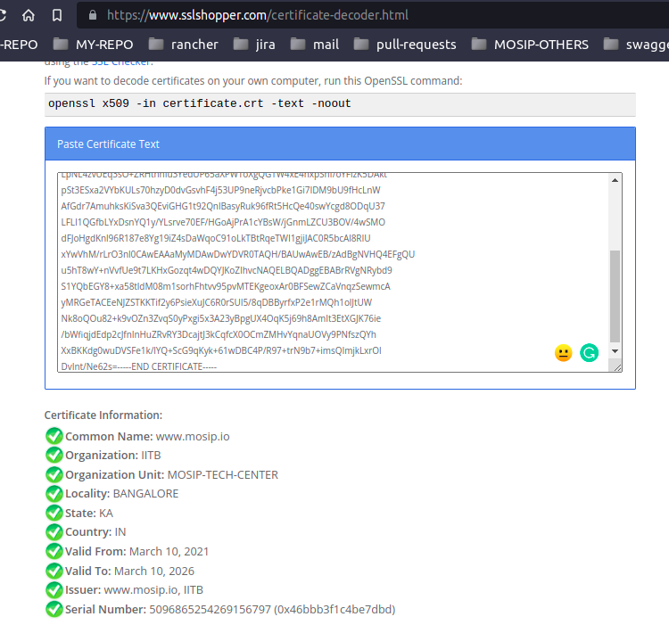
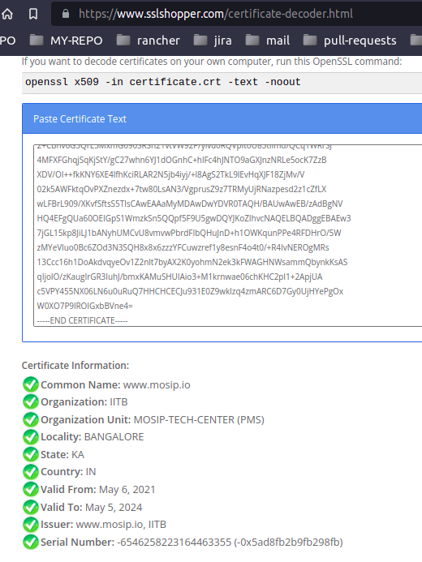
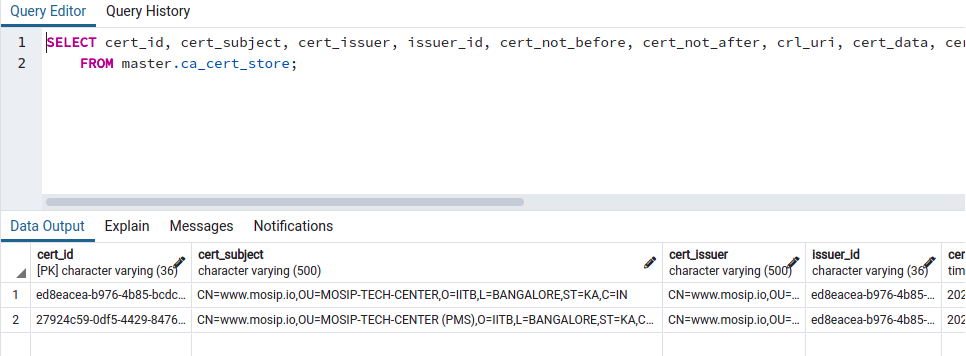

For trust validation in registration client we need to make sure the device certificates for the MDS are available in MOSIP's master.ca_cert_store table. Here, we expect the chain of certificates to be available so that these certificates gets synced to the registration client trust store (in derby database) and are used for trust validation when MDS signs any response using the device keys.

## Pre-requisites
We need to make sure that the MOSIP ROOT and MOSIP PMS certificates are available in MOSIP's master.ca_cert_store table. If not these needs to be added post deployment may be using a database script. In future releases this will be added automatically by the key manager when the these root keys are generated or updated.

The certificate uploaded by the device provider should be a CA signed certificate and the CA should be a approved CA by MOSIP. Hence we need to register the CA in MOSIP by uploading the CA certificate before the device provider uploads the certificate in PMS.

### Steps to add the MOSIP ROOT certificate

* Get a authentication token
    Request URL: `POST https://qa.mosip.net/v1/authmanager/authenticate/clientidsecretkey`
    Request Body:
    ```JSON
    {
      "id": "string",
      "metadata": {},
      "request": {
        "appId": "ida",
        "clientId": "mosip-ida-client",
        "secretKey": "<secret>"
      },
      "requesttime": "2018-12-10T06:12:52.994Z",
      "version": "string"
    }
    ```
    Response:
    ```JSON
    {
        "id": "string",
        "version": "string",
        "responsetime": "2021-05-06T08:29:04.570Z",
        "metadata": null,
        "response": {
            "status": "Success",
            "message": "Clientid and Token combination had been validated successfully"
        },
        "errors": null
    }
    ```

* Fetch the ROOT certificate from MOSIP's key manager API.
    Request URL: `GET https://qa.mosip.net/v1/keymanager/getCertificate?applicationId=ROOT`
    Response:
    ```JSON
    {
        "id": null,
        "version": null,
        "responsetime": "2021-05-06T08:42:34.697Z",
        "metadata": null,
        "response": {
            "certificate": "-----BEGIN CERTIFICATE-----\nMIIDmjCCAoKgAwIBAgIIaKo5PFVO9QcwDQYJKoZIhvcNAQELBQAwcDELMAkGA1UE\nBhMCSU4xCzAJBgNVBAgMAktBMRIwEAYDVQQHDAlCQU5HQUxPUkUxDTALBgNVBAoM\nBElJVEIxGjAYBgNVBAsMEU1PU0lQLVRFQ0gtQ0VOVEVSMRUwEwYDVQQDDAx3d3cu\nbW9zaXAuaW8wHhcNMjEwNDMwMTMyMjAzWhcNMjQwNDI5MTMyMjAzWjB2MQswCQYD\nVQQGEwJJTjELMAkGA1UECAwCS0ExEjAQBgNVBAcMCUJBTkdBTE9SRTENMAsGA1UE\nCgwESUlUQjEgMB4GA1UECwwXTU9TSVAtVEVDSC1DRU5URVIgKFBNUykxFTATBgNV\nBAMMDHd3dy5tb3NpcC5pbzCCASIwDQYJKoZIhvcNAQEBBQADggEPADCCAQoCggEB\nALWmQA+UlfT4n/DBUUyixUvOeH9siJa0UgcHRmYAkoVDLspPdc7lxPKcuHkQybAW\n9AMs1RFxtsF2dUEtXGpxvrP1Y4cVLxICZRJWvKlxOZ2Sj03zhqMH3hDXNtoPpEiU\nXdw3W6WSBTcdZJ2rBNk3ucV3knE4FnBLJ6P+SxFw3uB6gVwUEASJRs2JnJVdhD2H\n4bEjm/t1fpKEC1rUdmFi6ZQhjseVWSUh7Jwv4FCXieBtIL4MUs3WbkXIybytLsf6\nXHqL5JzEn0dOHKYiA9bqjlmXh8l7Z7r91E+UwCsb9lmiHlXm3g0GegRXHZwArkad\nIbNjAcTwzDHQZ+zQhKhiXjcCAwEAAaMyMDAwDwYDVR0TAQH/BAUwAwEB/zAdBgNV\nHQ4EFgQUvkXvEFHK3kJjsjPSRvEp6QRPjt4wDQYJKoZIhvcNAQELBQADggEBALiF\n5Xurad1U7SxTgviV1SeA1mInFw9jqD7y/xK/NFsPnV9Dm673u4ll2z+EqM19NeAn\nZEsIdOgWTm8+5sZDO02PksC7z96O7R/ZIL4eium1o4Mm0WdO6jhDR/4jVkvXu0PF\nU/UHSLKrS3XGRcHATAM5vWf8exla3S2OeNR+M+edSWv+2XdCpOJsFadIlFpvyHK8\nukD1iHK6GBDnMoUzCxmfyJ/kkStChDaLudoHmRokVMFrNEmvh3vyASbtNGg7du/2\n9YS2bxzpgAz99I719r/zyiXEJ5yheJKtlugvgacgwie+FFs+AZ81PTYU7T/8AJR+\n7gas1HC23MdBp4e7l0c=\n-----END CERTIFICATE-----\n",
            "certSignRequest": null,
            "issuedAt": "2021-04-30T13:22:03.000Z",
            "expiryAt": "2024-04-29T13:22:03.000Z",
            "timestamp": "2021-05-06T08:42:34.698Z"
        },
        "errors": null
    }
    ```
* Insert the ROOT certificate in the master.ca_cert_store table via insert query.
    * Decrypt the Root certificate and note down the values.
      
    * Update the query based on above values and get cert_thumbprint from `keymanager` DB `key_alias` table.
      ```
      INSERT INTO master.ca_cert_store (cert_id,cert_subject,cert_issuer,issuer_id,cert_not_before,cert_not_after,crl_uri,cert_data,cert_thumbprint,cert_serial_no,partner_domain,cr_by,cr_dtimes,upd_by,upd_dtimes,is_deleted,del_dtimes) VALUES
      ('3402d011-3755-4fe3-b389-d137d1071b79',
       'CN=www.mosip.io,OU=MOSIP-TECH-CENTER,O=IITB,L=BANGALORE,ST=KA,C=IN',
       'CN=www.mosip.io,OU=MOSIP-TECH-CENTER,O=IITB,L=BANGALORE,ST=KA,C=IN',
       '3402d011-3755-4fe3-b389-d137d1071b79',
       '2021-05-12 11:25:00.000','2024-05-06 11:25:00.000',NULL,
       '-----BEGIN CERTIFICATE-----
        MIIDlDCCAnygAwIBAgIIRruz8cS+fb0wDQYJKoZIhvcNAQELBQAwcDELMAkGA1UE
        BhMCSU4xCzAJBgNVBAgMAktBMRIwEAYDVQQHDAlCQU5HQUxPUkUxDTALBgNVBAoM
        BElJVEIxGjAYBgNVBAsMEU1PU0lQLVRFQ0gtQ0VOVEVSMRUwEwYDVQQDDAx3d3cu
        bW9zaXAuaW8wHhcNMjEwMzEwMTAzNjAwWhcNMjYwMzEwMTAzNjAwWjBwMQswCQYD
        VQQGEwJJTjELMAkGA1UECAwCS0ExEjAQBgNVBAcMCUJBTkdBTE9SRTENMAsGA1UE
        CgwESUlUQjEaMBgGA1UECwwRTU9TSVAtVEVDSC1DRU5URVIxFTATBgNVBAMMDHd3
        dy5tb3NpcC5pbzCCASIwDQYJKoZIhvcNAQEBBQADggEPADCCAQoCggEBALpZzgZy
        LpNL4zvUEq3sO+ZRHthhIu3YedUP65aXPWToXgQGTW4xE4hxpShf/oYFlzK5DAkt
        pSt3ESxa2VYbKULs70hzyD0dvGsvhF4j53UP9neRjvcbPke1Gi7IDM9bU9fHcLnW
        AfGdr7AmuhksKiSva3QEviGHG1t92QnlBasyRuk96fRt5HcQe40swYcgd8ODqU37
        LFLI1QGfbLYxDsnYQ1y/YLsrve70EF/HGoAjPrA1cYBsW/jGnmLZCU3BOV/4wSMO
        dFJoHgdKnl96R187e8Yg19iZ4sDaWqoC91oLkTBtRqeTWI1gjiJAC0R5bcAl8RIU
        xYwVhM/rLrO3nl0CAwEAAaMyMDAwDwYDVR0TAQH/BAUwAwEB/zAdBgNVHQ4EFgQU
        u5hT8wY+nVvfUe9t7LKHxGozqt4wDQYJKoZIhvcNAQELBQADggEBABrRVgNRybd9
        S1YQbEGY8+xa58tldM08m1sorhFhtvv95pvMTEKgeoxAr0BFSewZCaVnqzSewmcA
        yMRGeTACEeNJZSTKKTif2y6PsieXuJC6R0rSUI5/8qDBByrfxP2e1rMQh1olJtUW
        Nk8oQOu82+k9vOZn3ZvqS0yPxgi5x3A23yBpgUX4OqK5j69h8AmIt3EtXGJK76ie
        /bWfiqjdEdp2cJfnInHuZRvRY3DcajtJ3kCqfcX0OCmZMHvYqnaUOVy9PNfszQYh
        XxBKKdg0wuDVSFe1k/lYQ+ScG9qKyk+61wDBC4P/R97+trN9b7+imsQImjkLxrOl
        DvInt/Ne62s=-----END CERTIFICATE-----',
        '25f8194c4725d5e93dba6535db82b7adb4e55804',
        '5096865254269156797',
        'DEVICE','SYSTEM',now(),NULL,NULL,false,NULL);
      ```
    * Run the updated query on `master` DB


### Steps to add the MOSIP PMS ROOT certificate

* Get a authentication token same as before
* Fetch the PMS certificate from MOSIP's key manager API.
    Request URL: `GET https://qa.mosip.net/v1/keymanager/getCertificate?applicationId=PMS`
    Response:
    ```JSON
    {
        "id": null,
        "version": null,
        "responsetime": "2021-05-06T08:42:34.697Z",
        "metadata": null,
        "response": {
            "certificate": "-----BEGIN CERTIFICATE-----\nMIIDmjCCAoKgAwIBAgIIaKo5PFVO9QcwDQYJKoZIhvcNAQELBQAwcDELMAkGA1UE\nBhMCSU4xCzAJBgNVBAgMAktBMRIwEAYDVQQHDAlCQU5HQUxPUkUxDTALBgNVBAoM\nBElJVEIxGjAYBgNVBAsMEU1PU0lQLVRFQ0gtQ0VOVEVSMRUwEwYDVQQDDAx3d3cu\nbW9zaXAuaW8wHhcNMjEwNDMwMTMyMjAzWhcNMjQwNDI5MTMyMjAzWjB2MQswCQYD\nVQQGEwJJTjELMAkGA1UECAwCS0ExEjAQBgNVBAcMCUJBTkdBTE9SRTENMAsGA1UE\nCgwESUlUQjEgMB4GA1UECwwXTU9TSVAtVEVDSC1DRU5URVIgKFBNUykxFTATBgNV\nBAMMDHd3dy5tb3NpcC5pbzCCASIwDQYJKoZIhvcNAQEBBQADggEPADCCAQoCggEB\nALWmQA+UlfT4n/DBUUyixUvOeH9siJa0UgcHRmYAkoVDLspPdc7lxPKcuHkQybAW\n9AMs1RFxtsF2dUEtXGpxvrP1Y4cVLxICZRJWvKlxOZ2Sj03zhqMH3hDXNtoPpEiU\nXdw3W6WSBTcdZJ2rBNk3ucV3knE4FnBLJ6P+SxFw3uB6gVwUEASJRs2JnJVdhD2H\n4bEjm/t1fpKEC1rUdmFi6ZQhjseVWSUh7Jwv4FCXieBtIL4MUs3WbkXIybytLsf6\nXHqL5JzEn0dOHKYiA9bqjlmXh8l7Z7r91E+UwCsb9lmiHlXm3g0GegRXHZwArkad\nIbNjAcTwzDHQZ+zQhKhiXjcCAwEAAaMyMDAwDwYDVR0TAQH/BAUwAwEB/zAdBgNV\nHQ4EFgQUvkXvEFHK3kJjsjPSRvEp6QRPjt4wDQYJKoZIhvcNAQELBQADggEBALiF\n5Xurad1U7SxTgviV1SeA1mInFw9jqD7y/xK/NFsPnV9Dm673u4ll2z+EqM19NeAn\nZEsIdOgWTm8+5sZDO02PksC7z96O7R/ZIL4eium1o4Mm0WdO6jhDR/4jVkvXu0PF\nU/UHSLKrS3XGRcHATAM5vWf8exla3S2OeNR+M+edSWv+2XdCpOJsFadIlFpvyHK8\nukD1iHK6GBDnMoUzCxmfyJ/kkStChDaLudoHmRokVMFrNEmvh3vyASbtNGg7du/2\n9YS2bxzpgAz99I719r/zyiXEJ5yheJKtlugvgacgwie+FFs+AZ81PTYU7T/8AJR+\n7gas1HC23MdBp4e7l0c=\n-----END CERTIFICATE-----\n",
            "certSignRequest": null,
            "issuedAt": "2021-04-30T13:22:03.000Z",
            "expiryAt": "2024-04-29T13:22:03.000Z",
            "timestamp": "2021-05-06T08:42:34.698Z"
        },
        "errors": null
    }
    ```
* Insert the PMS certificate in the master.ca_cert_store table via query.
    * Decrypt the Root certificate and note down the values.
      
    * Update the query based on above values and get cert_thumbprint from `keymanager` DB `key_alias` table.
      ```
      INSERT INTO master.ca_cert_store (cert_id,cert_subject,cert_issuer,issuer_id,cert_not_before,cert_not_after,crl_uri,cert_data,cert_thumbprint,cert_serial_no,partner_domain,cr_by,cr_dtimes,upd_by,upd_dtimes,is_deleted,del_dtimes) VALUES
      ('c9dcbc9e-7577-4ae8-9f62-bc5e2c626cd5',
       'CN=www.mosip.io,OU=MOSIP-TECH-CENTER(PMS),O=IITB,L=BANGALORE,ST=KA,C=IN',
       'CN=www.mosip.io,OU=MOSIP-TECH-CENTER,O=IITB,L=BANGALORE,ST=KA,C=IN',
       '3402d011-3755-4fe3-b389-d137d1071b79',
       '2020-11-20 11:25:00.000','2023-11-20 11:25:00.000',NULL,
       '-----BEGIN CERTIFICATE-----
        MIIDmjCCAoKgAwIBAgIIpScE1GBNZwUwDQYJKoZIhvcNAQELBQAwcDELMAkGA1UE
        BhMCSU4xCzAJBgNVBAgMAktBMRIwEAYDVQQHDAlCQU5HQUxPUkUxDTALBgNVBAoM
        BElJVEIxGjAYBgNVBAsMEU1PU0lQLVRFQ0gtQ0VOVEVSMRUwEwYDVQQDDAx3d3cu
        bW9zaXAuaW8wHhcNMjEwNTA2MTQwOTQwWhcNMjQwNTA1MTQwOTQwWjB2MQswCQYD
        VQQGEwJJTjELMAkGA1UECAwCS0ExEjAQBgNVBAcMCUJBTkdBTE9SRTENMAsGA1UE
        CgwESUlUQjEgMB4GA1UECwwXTU9TSVAtVEVDSC1DRU5URVIgKFBNUykxFTATBgNV
        BAMMDHd3dy5tb3NpcC5pbzCCASIwDQYJKoZIhvcNAQEBBQADggEPADCCAQoCggEB
        AL5mAhnVD24iGShd5LtupPC/UdaUGygh34gT3cBVxTDMaw+2TmHZmkg6PfrSwR7R
        2+CBhv6G3QrE3MxmG690SRSh21vtVW92P/ylvu0RQVpItoU85tIImu/QCq1WRrSJ
        4MFXFGhqjSqKjStY/gC27whn6YJ1dOGnhC+hlFc4hJNTO9aGXJnzNRLe5ocK7ZzB
        XDV/OI++fkKNY6XE4lfhKciRLAR2N5jb4iyj/+l8AgS2TkL9lEvHqXJF18ZjMv/V
        02k5AWFktqOvPXZnezdx+7tw80LsAN3/VgprusZ9z7TRMyUjRNazpesd2z1cZfLX
        wLFBrL909/XKvfSftsS5TIsCAwEAAaMyMDAwDwYDVR0TAQH/BAUwAwEB/zAdBgNV
        HQ4EFgQUa60OEIGpS1WmzkSn5QQpf5F9U5gwDQYJKoZIhvcNAQELBQADggEBAEw3
        7jGL15kp8JiLJ1bANyhUMCvU8vmvwPbrdFIbQHuJnD+h1OWKqunPPe4RFDHrO/5W
        zMYeVIuo0Bc6ZOd3N3SQH8x8x6zzzYFCuwzref1y8esnF4o4t0/+R4IvNEROgMRs
        13Ccc16h1DoAkdvqyeOv1Z2nlt7byAX2K0yohmN2ek3kFWAGHNWsammQbynkKsAS
        qIjoIO/zKaugIrGR3IuhJ/bmxKAMuSHUIAio3+M1krnwae06chKHC2pI1+2ApjUA
        c5VPY455NX06LN6u0uRuQ7HHCHCECJu931E0Z9wkIzq4zmARC6D7Gy0UjHYePgOx
        W0XO7P9lROIGxbBVne4=
        -----END CERTIFICATE-----',
       '651D0A6BB0B25CB81EA50A8CD5D1AFFA6E0B2E942A714AC35FA49D068403A7C8',
       '-6546258223164463355',
       'DEVICE','SYSTEM',now(),NULL,NULL,false,NULL);
      ```
    * Run the updated query on `master` DB

* View ROOT & PMS certificates on master DB ca_cert_store table.
  

### Steps to add a Device Provider CA in MOSIP

* Get a authentication token
    Request URL: `POST https://qa.mosip.net/v1/authmanager/authenticate/clientidsecretkey`
    Request Body:
    ```JSON
    {
	  "id": "string",
	  "metadata": {},
	  "request": {
	    "appId": "ida",
	    "clientId": "mosip-pms-client",
	    "secretKey": "<secret>"
	  },
	  "requesttime": "2018-12-10T06:12:52.994Z",
	  "version": "string"
	}
    ```
    Response:
    ```JSON
    {
        "id": "string",
        "version": "string",
        "responsetime": "2021-05-06T08:29:04.570Z",
        "metadata": null,
        "response": {
            "status": "Success",
            "message": "Clientid and Token combination had been validated successfully"
        },
        "errors": null
    }
    ```
* Upload CA Certificate
    Request URL: `POST https://qa.mosip.net/v1/partnermanager/partners/certificate/ca/upload`
    Request Body:
    ```JSON
    {
        "id": "string",
        "metadata": {},
        "request": {
            "certificateData": "<CA certificate>",
            "partnerDomain": "DEVICE"
        },
        "requesttime": "2021-03-24T08:24:13.349Z",
        "version": "string"
    }
    ```

## Procedure
Once the ROOT certificates are in Master DB and the Device Provider CA certificate is in MOSIP. We can proceed with the upload of device provider certificate.

### Steps to add partner & partner certificate

* Create a device partner
    Request URL: `POST https://qa.mosip.net/v1/partnermanager/partners`
    Request Body: 
    ```JSON
    {
        "id": "string",
        "metadata": {},
        "request": {
            "address": "ABC Address",
            "contactNumber": "9999999999",
            "emailId": "abc@gmail.com",
            "organizationName": "ABC",
            "partnerId": "ABC123",
            "partnerType": "Device_Provider",
            "policyGroup": ""
        },
        "requesttime": "",
        "version": "string"
    }
    ```
* Upload the device provider certificate
    Note: We need to make sure that the 'O' element in the certificate should be same as the Organization Name of the partner and the CA who signed the certificate should be available in MOSIP.

    Request URL: `POST https://qa.mosip.net/v1/partnermanager/partners/certificate/upload`
    Request Body: 
    ```JSON
    {
        "id": "string",
        "metadata": {},
        "request": {
            "certificateData": "<certificate data>",
            "partnerDomain": "DEVICE",
            "partnerId": "ABC123"
        },
        "requesttime": "",
        "version": "string"
    }
    ```
    Response:
    ```JSON
    {
        "id": "string",
        "metadata": {},
        "response": {
            "certificateId": "<Certificate ID>",
            "signedCertificateData": "<MOSIP Signed Certificate>",
            "timestamp": "2021-05-06T09:11:45.952Z"
        },
        "responsetime": "2021-03-24T08:24:13.349Z",
        "version": "string"
        "errors": null
    }
    ```

### Steps to build mock MDS
 We should now create a key store and use it in MOCK MDS for creating MDS Device Keys.
