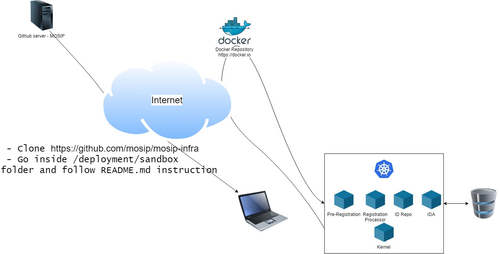

# MOSIP Sandbox Installer
  
The Ansible scripts here install MOSIP on a single machine. This is a single node Minikube and Docker based installation useful for developers and pilots. The scripts here serve as reference for larger scale deployment with different architecture.

## Software requirements
Operating System : Linux (ubuntu 18.04)

## Hardware requirements
* Number of CPUs: 12
* RAM: 48GB
* HDD: 2TB

## Setup overview

## Run
1. Clone this repo
`$ git clone https://github.com/mosip/mosip-infra.git`
1. Edit `mosip-infra/deployment/sandbox/playbooks-properties/all-playbooks.properties` with appropriate values
1. Run `/mosip-infra/deployment/sandbox/install-ansible-run-playbooks.sh`     
`$ sudo sh install-ansible-run-playbooks.sh`

## Test

Pre-Registration:
1. Open the URL <TODO> in the browser to access Pre-Registration module
