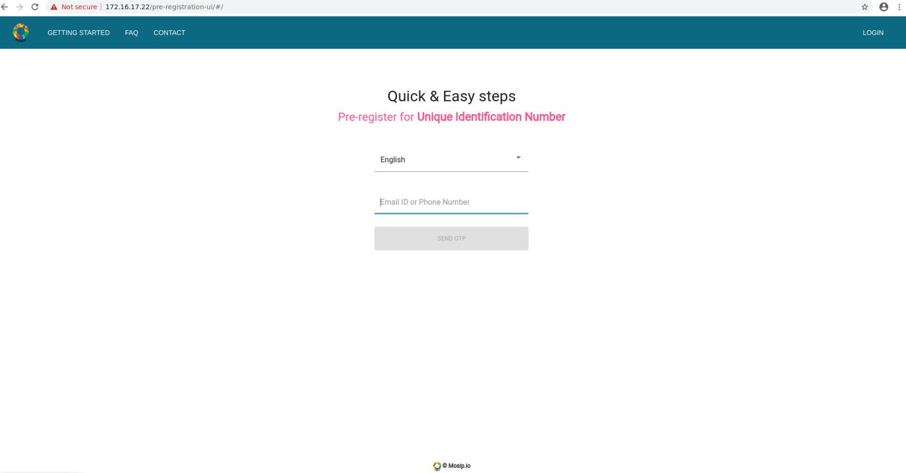

# MOSIP Sandbox Deployer
  
Enables the creation of MOSIP sandbox on a Linux OS.  Using pre-crafted docker images, it enables one to quickly setup MOSIP for trying and demonstrating. 

THIS IS NOT FOR PRODUCTION DEPLOYMENTS.  

## Overview

## Pre-requisites
This has been tried and verified

      * OS : Ubuntu 18.0.4 LTS
      * Hardware : 4 core CPU with 32 GB RAM and a about 200 GB of free hard disk space.
      * Make sure you have installed 'curl' and 'git'
      
## Get, Set, Go!
1. Clone the 'mosip-infra' repo

       $ git clone https://github.com/mosip/mosip-infra

1. Edit `mosip-infra/deployment/sandbox/playbooks-properties/all-playbooks.properties` with appropriate values (Change only \<ToBeReplaced\>)

  * Below is the sample key-value pair of the playbook properties
  
          spring.mail.username=xxx@gmail.com
          spring.mail.password=xxxpwd
          spring.mail.host=smtp.gmail.com
          spring.mail.port=587
          mosip.kernel.sms.gateway=SMSgatewayProviderName
          mosip.kernel.sms.api=<SMS POST message URL> eg:- https://SMSGatewayHostName/sms/2/text/single
          mosip.kernel.sms.username=<registered username with SMS gateway provider>
          mosip.kernel.sms.password=<registered password>
          mosip.kernel.sms.sender=<SMS Sender name, can be any name>
          registration.processor.dmz.server.password=<password>
          
1. Change over to 'sandbox' folder which has the shell scripts for installing various MOSIP components

       $ cd ~/mosip-infra/deployment/sandbox/

1. First, install the MOSIP Kernel.  This is the base for all other modules.

       $ sudo sh install-mosip-kernel.sh

1. Check for errors in 'install-mosip-sandbox.log'.  Go to the last time and check for 'failed=0' which indicates that there are no failures during the deployment.

1. If there are no errors in the log, wait for about 5 minutes for the kernel services to be up and running.

 install-mosip-pre-reg.sh
***  
  
#### Pre-registration 
1. Install the MOSIP Pre-registration component

       $ sudo sh install-mosip-pre-reg.sh
    
1. Check for errors in 'install-mosip-sandbox.log'.  Go to the last time and check for 'failed=0' which indicates that there are no failures during the deployment.

1. If there are no errors in the log, wait for about 10 minutes for the pre-registration services to be up and running.
 install-mosip-pre-reg.sh
 
1. MOSIP Pre-registration UI can be accessed through a browser using *http://\<hostname or ip address\>/pre-registration-ui*
   
    1. Sample screen of Pre-registration startup page

            
    1. Login into the Pre-registration portal using OTP sent to email or phone.  

***

#### Registration Processor
1. Install the MOSIP Registration processor component

       $ sudo sh install-mosip-reg-proc.sh
    
1. Check for errors in 'install-mosip-sandbox.log'.  Go to the last time and check for 'failed=0' which indicates that there are no failures during the deployment.

#### ID Authentication

#### ID Repo

