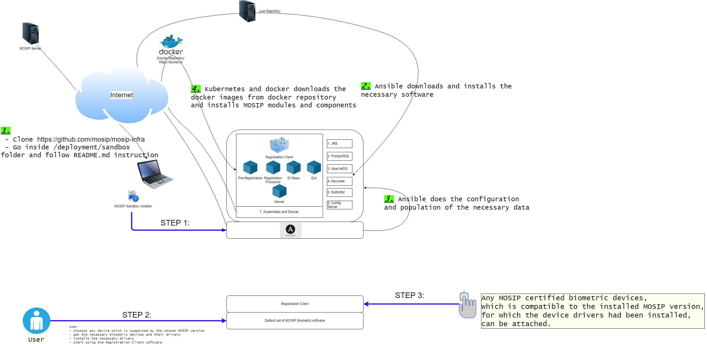

# MOSIP Sandbox Installer
  
The Ansible scripts here install MOSIP on a single machine. This is a single node Minikube and Docker based installation useful for developers and pilots. The scripts here serve as reference for larger scale deployment with different architecture.

## Software requirements
Operating System : Linux (ubuntu 18.04)

## Hardware requirements
* Number of CPUs: 12
* RAM: 48GB
* HDD: 2TB

## Setup overview

## Run
1. Clone this repo.  
`$ git clone https://github.com/mosip/mosip-infra.git`
1. Install Ansible
1. Run Ansible scripts

## Test

## Sandbox external components
You need to connect to an SMS and Email Gateway to test notifications.  Default gateways with a minimum subscription limit is provided with this installer.

