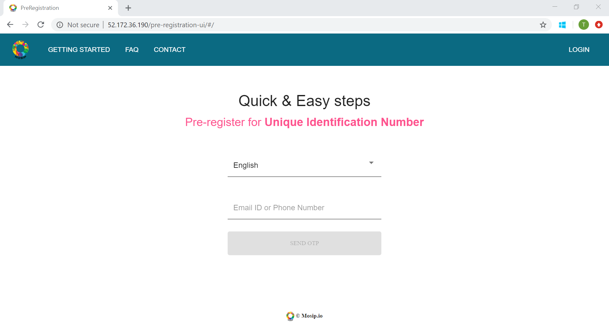

# MOSIP Sandbox Deployer

MOSIP Sandbox deployer enables anyone to build and deploy MOSIP on a single machine (with Linux OS). As we use pre-crafted docker images, we can quickly setup MOSIP and use it for demonstration.

**THIS IS NOT FOR PRODUCTION DEPLOYMENTS.**

## Overview


## Pre-requisites
* OS : Ubuntu 18.0.4 LTS
* Hardware
  * For Running Kernel and Pre Registration -> 4 core CPU with 32 GB RAM and about 80 GB of free hard disk space.
  * For Running Kernel, Registration Processor and ID Repo -> 8 core CPU with 56 GB RAM and about 80 GB of free hard disk space
* Tools:  Install `curl` and `git`
      
## Get, Set, Go!
1.  Clone this repo:
    ```
    $ git clone https://github.com/mosip/mosip-infra
    ```
1. Go to the root:
    ```
    $ sudo su
    ```
1.  Edit `mosip-infra/deployment/sandbox/playbooks-properties/all-playbooks.properties` with appropriate values (change only `<ToBeReplaced\>`)

    Below is a sample (example) key-value pair of the playbook properties
    ```
    spring.mail.username=xxx@gmail.com
    spring.mail.password=xxxpwd
    spring.mail.host=smtp.gmail.com
    spring.mail.port=587
    mosip.kernel.sms.gateway=SMSgatewayProviderName
    mosip.kernel.sms.api=https://SMSGatewayHostName/sms/2/text/single
    mosip.kernel.sms.username=<registered username with SMS gateway provider>
    mosip.kernel.sms.password=<registered password>
    mosip.kernel.sms.sender=<SMS Sender name, can be any name>
    ```
    
    (Tip-> If you do not have a SMS service provider, you can replace the configurations related to SMS (i.e. gateway, api, username, password and sender) with dummy values)
    
1.  Change to 'sandbox' dir: 
    ```
    $ cd mosip-infra/deployment/sandbox/
    ````
### MOSIP Kernel
1. First, install the kernel module. This is the base for all other modules.
    ```
    $ sh install-mosip-kernel.sh
    ```
1. Check for errors in `install-mosip-sandbox.log`. Go to the last line and check for `failed=0` which indicates that there are no failures during the deployment.

1. If there are no errors in the log, wait for about 5 minutes for the kernel services to be up and running. 

### MOSIP Pre-registration 
1. Install the pre-registration module.
    ```
    $ sh install-mosip-pre-reg.sh
    ```    
1. Check for errors in `install-mosip-sandbox.log`. Go to the last line and check for `failed=0` which indicates that there are no failures during the deployment.

1. If there are no errors in the log, wait for about 10 minutes for the pre-registration services to be up and running.

#### Steps to access the Pre-registration-ui
1. Sandbox works on private IP address, hence, you have to access the pre-registration ui from the chrome browser installed inside the machine on which you are working on.
   
1. Please follow this link for [Installing the Google Chrome Browser in your Ubuntu Machine](https://linuxconfig.org/how-to-install-google-chrome-web-browser-on-ubuntu-18-04-bionic-beaver-linux).

1. Please follow this link for [Installing the Remote Desktop in your Ubuntu Machine](https://gist.github.com/hehuan2112/54cca01be23973a9f8b369e8d0df216e). 
   After restarting the xRDP service, which is the last instruction in the above link, connect your ubuntu machine from RDP application present in your Windows system.
   
   Now you have UI access in your ubuntu machine. 
   (Tip-> You will need to open 3389 port number from the cloud side)
   
1. After connecting to the ubuntu machine from RDP application, open the chrome browser.
 
1. MOSIP Pre-registration UI can be accessed using *http://\<private ip address\>/pre-registration-ui*
    * Note :  To find the private ip address, you may use the following command 
          
          $ hostname -I | awk '{print $1}'
             
    * Sample screen of Pre-registration startup page


1. Login into the Pre-registration portal using OTP sent to email or phone.

### MOSIP Registration Processor
1. Install the registration processor module.
    ```
    $ sh install-mosip-reg-proc.sh
    ```    
1. Check for errors in `install-mosip-sandbox.log`. Go to the last line and check for `failed=0` which indicates that there are no failures during the deployment.

1. If there are no errors in the log, wait for about 10 minutes for the registration-processor services to be up and running.
