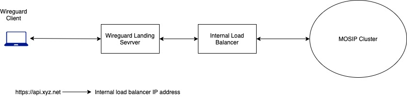

# MOSIP cluster on Amazon EKS

## Create using eksctl
* If you already have `~/.kube/config` file created for another cluster, rename it.
* Install k8s cluster using `eksctl` as given [here](https://docs.aws.amazon.com/eks/latest/userguide/eksctl.html)
* Install `kubectl`
* Set AWS credentials in `~/.aws/` folder (refer AWS documentation)
* Copy `cluster.config.sample` to `cluster.config`.  
* Review the parameters of `cluster.config` carefully.
* Install
```sh
eksctl create cluster -f cluster.config
```
* Note that it takes around 30 minutes to create (or delete a cluster).
* After creating cluster make a copy of `config` with a suitable name in `~/.kube/` folder, eg. `iam_config`, `mosip_config`.

## Global configmap
* Copy `../global_configmap.yaml.sample` to `../global_configmap.yaml`  
* Update the domain names in `../global_configmap.yaml` and run
```sh
kubectl apply -f ../global_configmap.yaml
```
## Create using Rancher
You can also create cluster on Cloud using the Rancher console.  Refer to Rancher documentation.

## Persistence
### GP2 
* Default storage class is `gp2` which by is in "Delete" mode which means if PV is deleted, the underlying storage is also deleted.  
* To retain define a storage class `gp2-retain` by running `sc.yaml`. This will retain the PV. You will have to delete the storage from AWS console.  See some more details on persistence [here](../../docs/persistence.md).
```sh
kubectl apply -f sc.yaml
```
* If the PV gets deleted (say cluster was retarted), then you will have to define a PV connecting to this instance of storage (you will need volume ID etc). TODO: how to do this?

### LongHorn
Install LongHorn as given [here](../longhorn/README.md)

### EFS
EFS may not be necessary if you are using LongHorn + backup on S3. However, if needed you may install it as given [here](efs/README.md)

## Ingress and load balancer (LB)
Ingress is not installed by default on EKS. We use Istio ingress gateway controller to allow traffic in the cluster. Two channels are created - public and internal. See [architecture](../../docs/images/deployment_architecture.png).
* Install ingresses as given here:
```sh
cd istio
./install.sh
```
### Load Balancers
The above steps will spin-off two load balancers on AWS. You may view them on AWS console.  These may be also seen with
```sh
kubectl -n istio-system get svc
```
* TLS termination is supposed to be on LB.  So all our traffic coming to ingress controller shall be HTTP.
* Obtain AWS TLS certificate as given [here](https://docs.aws.amazon.com/acm/latest/userguide/dns-validation.html) 
* Add the certificates and 443 access to the LB listener.
* Update listener TCP->443 to **TLS->443** and point to the certificate of domain name that belongs to your cluster.
* Forward TLS->443 listner traffic to target group that corresponds to listner on port 80. This is because after TLS termination the protocol is HTTP so we must point LB to HTTP port of ingress controller.
* Update health check ports of LB target groups to node port corresponding to port 15021. You can see the node ports with
```sh
kubectl -n istio-system get svc
```
* Enable Proxy Protocol v2 on target groups.

The reason for considering a LB for ingress is such that TLS termination can happen at the LB and packets can be inspected before sending to cluster ingress.  Thus ingress will receive plain text. On EKS, we will assume that the connection between Loadbalancer and cluster machines is secure (Wireguard cannot be installed on LB).

### Domain name
* Point your domain names to respective LB's public DNS/IP. 
* On AWS this may be done on Route 53 console.  You will have to add a CNAME record if your LB has public DNS or an A record if IP address.

## Metrics server
Although Prometheus runs it own metrics server to collect data, it is useful to install Kubernets Metrics Server.  The same will enable `kubectl top` command and also some of the metrics in Rancher UI. Install as below:
```sh
helm -n default install metrics-server bitnami/metrics-server 
helm -n default upgrade metrics-server bitnami/metrics-server  --set apiService.create=true
``` 
We have installed in `default` namespace.  You may choose any other namespace as per your deployment.

## Wireguard bastion host
If you do not want public access to your installation, you may set up a bastion host running Wireguard as shown below:


Follow the procedure given [here](../../docs/wireguard_bastion.md)

## Httpbin
Install `httpbin` for testing the wiring as given [here](../../utils/httpbin/README.md)

## Log rotation
The default log max log file size set on EKS cluster is 10MB with max number of files as 10.  Refer to `/etc/docker/daemon.json` on any node. 

## Cluster management
Import cluster into Rancher and assign access rights users in IAM (Keycloak)

## Increase/delete nodes
In Rancher console, under Edit Cluster, increase the Desired ASG size to the number of nodes you need.  Nodes should get created.  

## Troubleshooting
* **TLS Handshake issue**: If while accessing resources you see error as mentioned [here](https://stackoverflow.com/questions/51302515/kubernetes-net-http-tls-handshake-timeout-when-fetching-logs-baremetal), then it could be due to node(s) not availability due to resource constraints (RAM, storage, compute).  Either add nodes or delete pods.
* **Unable to delete pod**: This could be due to the above issue.  Force delete.  Example:
```
kc -n logging delete pod --grace-period=0 --force elasticsearch-master-1
```
* "Bad Gateway" from ingress controller:  Could be due to enabling proxy protocol v2 but not running `istio/proxy_protoco.yaml` 
