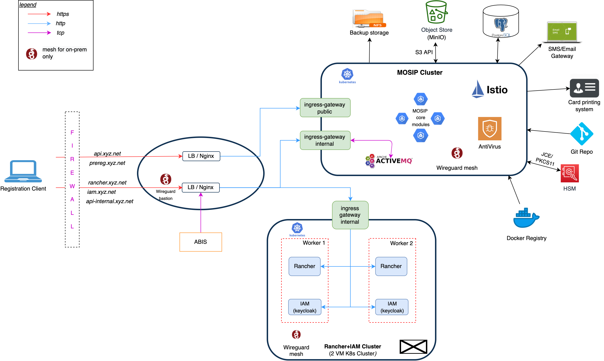

# MOSIP and Rancher clusters on-premise




## Architecture

Before getting started be aware of your infrastructure architecture.  In the above architecture it is assumed that, the landing-zone node(for ssh into the other nodes, etc), the external nginx node, and the wireguard bastion node, all three are clubbed together. But during production, one might choose to use nginx plus cluster, or one might choose not have any landing zone for ssh, or etc, and in those cases the procedure has to change accordingly.

## Prerequisites

Refer to [this](./requirements.md) for the requirements or prerequisites before getting started.

##  Rancher + IAM Cluster

### Cluster setup
* Set up VMs.
* [Optional] Install Wireguard as given [here](wireguard-mesh/README.md). In this case, give `internal_address: <wireguard address>` in `rke config`.
* Create K8s cluster, for Rancher and IAM with at least 2 worker nodes using `rke` utility. Using [here](../../docs/rke-setup.md).
* The rest of the document assumes `kcr` and `helmr` as this rancher cluster kubectl alias and helm alias.

### Metallb 

Metallb is suitable for **baremetal** installations and requires specific network configurations (like Routers to have BGP protocol enabled).  If you you have virtual machines in your on-prem infra, you may skip installing Metallb, but instead use Nginx as loadbalancer directly talking to Istio ingress services in Nodeport mode.  Of course, the node ports have to be manually enabled on the nodes as well as Nginx.  

If you would like to install Metallb, check the instructions [here](./metallb/)

### Istio for Service Discovery and Ingress

* Go it [v3/rancher/on-prem/istio](../../rancher/on-prem/istio).
* Edit the `install.sh` and `iop.yaml` accordingly, then run it.
  ```
  KUBECONFIG="~/.kube/rancher_iam.config" ./install.sh
  ```
* This will bring up all istio components and the ingress-gateways.
* These ingressgateway services are of type loadbalancer. And metallb will have provisioned loadbalancer ips for the ingressgateway service.
  ```
  kcr get svc -n istio-system
  ```

###  External Nginx setup

* Use [this](./nginx/) to install nginx on an external node that proxies traffic to the above loadbalancers.

### Wireguard Bastion

* Use [this](../../docs/wireguard_bastion.md) to install wireguard bastion server on an external node, preferrable the same as the nginx node above.

###  Rancher install

* This will bring up rancher. After this wait for a few minutes and try accessing the rancher with the hostname, ex: `rancher.mosip.xyz.net`, from the browser.
  ```
  KUBECONFIG="$HOME/.kube/rancher_iam.config"
  helm repo add rancher-latest https://releases.rancher.com/server-charts/latest
  helm install rancher rancher-latest/rancher --namespace cattle-system --set hostname=rancher.mosip.xyz.net --set replicas=2 --set tls=external --set ingress.enabled=false
  ```

### Longhorn for persistence

* Install Longhorn as given [here](../longhorn/README.md)

###  IAM (Keycloak) install

* [Optional] Since longhorn is now installed, persistance can also be enabled for keycloak.
* Go [here](../../external/iam) and use install.sh
* Then integrate IAM with rancher. Find the steps in the same page.

## Mosip cluster

###  Cluster setup

* Follow same as in section 1.1 and create a new cluster, using rke with [this](../../docs/rke-setup.md). This cluster we will refer to as mosip cluster, where all mosip external and core components will be isntalled.
* `rke config`
* Edit the following in the `cluster.yml`.
  * ```
    ingress:
      provider: none
    ```
  * ```
    services:
      kube-controller:
        extra_args:
          cluster-signing-cert-file: "/etc/kubernetes/ssl/kube-ca.pem"
          cluster-signing-key-file: "/etc/kubernetes/ssl/kube-ca-key.pem"
    ```
  * `rke up`
* The above will give a new `kube_config_cluster.yml` file. Place it in `~/.kube/` with different name like `mosip_cluster.config`. Dont forget to make new aliases with this `KUBECONFIG`, for `kubectl` and `helm`, etc, for this new cluster, or these will get mixed up with previous rancher cluster.

### Metallb

See above section on Metallb.

### Global configmap

* Copy `../global_configmap.yaml.sample` to `../global_configmap.yaml`  
* Update the domain names in `../global_configmap.yaml` and run
```
kubectl apply -f ../global_configmap.yaml
```

### Istio setup

* Go to [v3/cluster/on-prem/istio](./istio/).
* Edit the `install.sh` and `iop.yaml` accordingly and install it.
  ```
  KUBECONFIG="$HOME/.kube/mosip_cluster.config"
  ./install.sh
  ```

### External Nginx setup

* Use [this](./nginx/), same as above sections.
  * Add/Edit the servers in the `nginx.conf` with the new loadbalancer ips from the istio ingressgateway services from mosip cluster.
  * Restart that nginx.

### Rancher integration

* Assumging Rancher cluster is ready, after Section 1, open that dashboard. Click on add cluster on top right.
* Add members, atleast one as Owner.
* In the cluster type selection screen, at the top, there is an option to "import any other kubernetes cluster", selct that.
* That should give two commands to run on the new cluster (the mosip cluster). After running those, the new cluster should be integrated into Rancher.

### Longhorn setup

* Follow the same above section.
