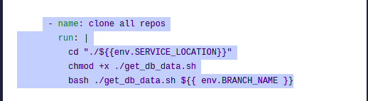
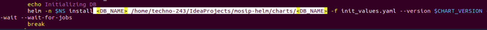

# Procedure to be followed while performing below steps

1. Procedure to add new DB.
2. Procedure to add a new client and its secret.
3. Procedure for Restart of all the services in the particular module
4. Procedure for Redeploy services on cmd
5. Manual reprocess
6. Procedure for Rollout restarts

## Procedure to add new DB

* We have two procedure for DB change
1. How to deploy a new DB from our local
2. How to deploy a new DB using Kubernetes jobs

## 1. To deploy a new DB from our local, we have to follow the below steps

* Clone the particular github repo to local
* Update the following environment variables in deploy.properties file

* After setting up all these values in the respective folder of github repo
* Run the deploy.sh to deploy the db
   * **bash deploy.sh deploy.properties**
* The db will be created and we can check in the database for the specific environment

## 2. To deploy a new DB using Kubernetes jobs, we have to follow the below steps:

*  Make sure you have  the  postgres-init helm/chart in your local
* Set the kubeconfig file to particular environment ( for which environment you have to deploy)
   * Download Kubernetes cluster kubeconfig file from rancher dashboard to your local.
   
   * Install kubectl package to your local machine.
   * Set  kubeconfig  to the particular environment using  **cp <yaml.file> config** command
   * Check whether kubeconfig pointing to correct cluster or not using command **kubectl config view**
   
* Add repo name in postgress-int repo-list.txt ( https://github.com/mosip/postgres-init/blob/develop/postgres-init/repo-list.txt)

* Add new db name in postgres-init Dockerfile ( https://github.com/mosip/postgres-init/blob/develop/postgres-init/Dockerfile)

* Make sure db scripts repo should have the same branch as postgres-init , this will taken care by the workflows/push_trigger.yml (https://github.com/mosip/postgres-init/blob/develop/.github/workflows/push_trigger.yml)

* Update postgres-init helm/chart under database section in mosip-helm postgres-init/values.yaml ( https://github.com/mosip/mosip-helm/blob/develop/charts/postgres-init/values.yaml)

* For a new db , you have to create  a new <DB_NAME>-env-configmap.yaml and <DB_NAME>-job.yaml for the particular db in the templates section of mosip-helm postgres-init/templates ( https://github.com/mosip/mosip-helm/tree/develop/charts/postgres-init/templates)
*  Make these below changes in mosip-infra postgres/init_values.yaml ( https://github.com/mosip/mosip-infra/blob/develop/deployment/v3/external/postgres/init_values.yam )
    * Add the database name in postgres/init_values.yaml, make sure enabled to true
    
    *  Set remaining database to false in init_values.yaml, if we want to deploy only one db
    
* Make these below changes in mosip-infra postgres/init_db.sh ( https://github.com/mosip/mosip-infra/blob/develop/deployment/v3/external/postgres/init_db.sh)
   * Change the name from postgres-init to new <DB_NAME>
   
   * Update the local helm path in the install script  (/home/techno-243/IdeaProjects/mosip-helm/charts/<DB_NAME>)
   
* Run init_db.sh , it will create the db in that particular environment

## Procedure to add a new client and its secret.

1. To add a new client and its secret in keycloak-init 
2. To add a new client in running keycloak 

## 1. To add a new client and its secret in keycloak-init , we need to follow the below procedure

* Go to keycloak-init helm/chart ( https://github.com/mosip/mosip-helm/tree/develop/charts/keycloak-init)
* Make these below changes in mosip-helm keycloak-init/values.yaml  ( https://github.com/mosip/mosip-helm/blob/develop/charts/keycloak-init/values.yaml)
   * Check wheather that roles exists or not under realms section in that particluar helm (https://github.com/mosip/mosip-helm/blob/develop/charts/keycloak-init/values.yaml )
   
   * We have to add that particular client  under client section ( https://github.com/mosip/mosip-helm/blob/develop/charts/keycloak-init/values.yaml )
   

## 2. To add a new client in running keycloack , we need to follow the below procedure

* Create helm chart for particular client in mosip-helm
* If we add a new client or secret it should be updated in _overides.tpl

* Add the clients and secrets  in mosip-helm repo keycloak-init/values.yml file

* Add particular client in keycloak clients in the keycloak

* After saving the data in keycloak client section, you can see the secret

* Add the same secret in the rancher ( namespace:config-server / keycloack-clients-secrete)

* Also add the same secret in rancher (namespace:keycloak/ keycloack-clients-secrete)

* Once secret added in rancher, edit the yaml file of config-server deployment and add the client and secret

* Once the config-server service is up,restart the respective service

## Procedure for Restart of all the services in the particular module

1. Restart of all the services for a particular module in rancher, you have to make sure the below points
2. Restart a specific services in that particular module in rancher, you have to make sure the below points
3. Restart of all the  MOSIP services using script

## 1. If you want to restart of all the services for a particular module in rancher, you have to make sure the below points

* Select the namespace for particular module

* Make sure you are in pod section 

* To restart of all services in the particular module, select the state checkbox  in pod section and click on delete 

* It will ask for confirmation then delete the same

## 2. If you want to restart of specific services of that particular module in rancher, you have to make sure the below points

* Select the namespace for particular module   

* Make sure you are in pod section

* To restart of specific services, select the particular service checkbox and click on delete, it will ask for confirmation then delete the same

## 3. To restart all the services using script

* Run restart-all.sh to restart all the mosip services  in mosip-infra (https://github.com/mosip/mosip-infra/tree/develop/deployment/v3/mosip/all)

##  Procedure for Redeploy services on cmd

* Set the kubeconfig file to particular environment ( for which environment you have to deploy)
   * Download Kubernetes cluster kubeconfig file from rancher dashboard to your local.
   
   * Install kubectl package to your local machine
   * Set kubeconfig to the particular environment using cp <yaml.file> config command
   
   * Check whether kubeconfig pointing to correct cluster or not using below command Kubectl config view  command
   
* To redeploy of services, use the following two steps
   * Run delete.sh script to delete the services
   
   * Run install.sh script to install services
   

## Manual reprocess

* If you want to run any script manually , just follow the below attached link
  ( https://github.com/mosip/mosip-infra/tree/1.2.0.1/deployment/v3/utils/reprocess#reproces-packet )

## Procedure for Rollout restarts

A rolling restart is shutting down and updating nodes one at a time (while the other nodes are running) until they're all updated

* For a rolling restart, we run the following commands:

1. Run the kubectl get pods command to verify the pods running

2. Run the rollout restart command  to restart the pods one by one without impacting the deployment 
    * **kubectl get deployment**
    
    * **kubectl rollout restart deployment <deployment_name>** 
    
    * kubectl get pods command below to view the pods running 
    

