# Create Gmail APP Password To Send Mails Via SMTP


1. Remove `management.health.mail.enabled` property from kernel property file in config if the property exists.
2. Create new gmail account via [link](https://accounts.google.com/signup/v2/webcreateaccount?continue=https%3A%2F%2Faccounts.google.com%2F&dsh=S856407536%3A1655162931377859&biz=false&flowName=GlifWebSignIn&flowEntry=SignUp) if email does not exist.
3. Login to the gmail account via [link](https://accounts.google.com/signin) <br>
   Enter your email ID.
   
   Enter your password.
   
4. Goto `security` section and enable `Use your phone to sign in`.
   
   Click on `Next`.
   
   Provide password
   
   Click on `Send` to get OTP to your mobile number
   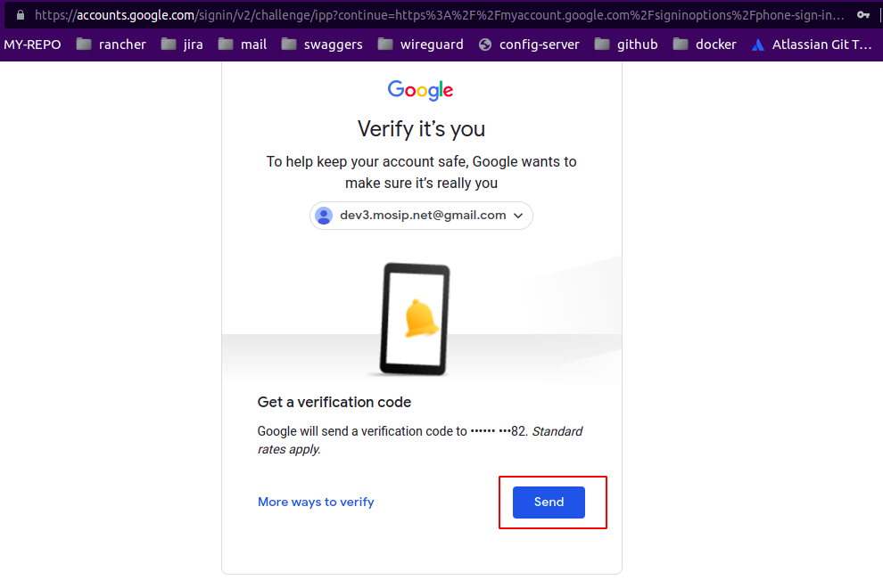
   Enter `OTP` which is sent to your mobile number and click on `Next`.
   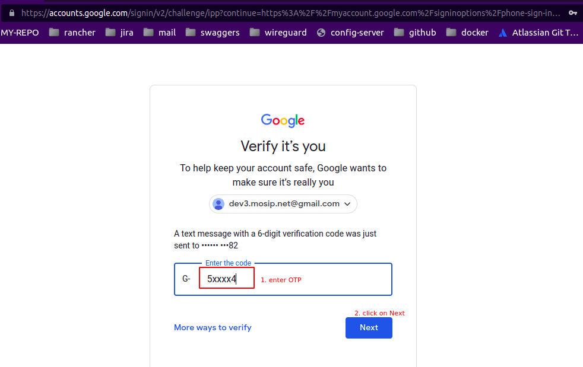
   Make sure that you have logged into your mobile with the same Gmail ID used here.
   Select your `phone` and click on `Next`.
   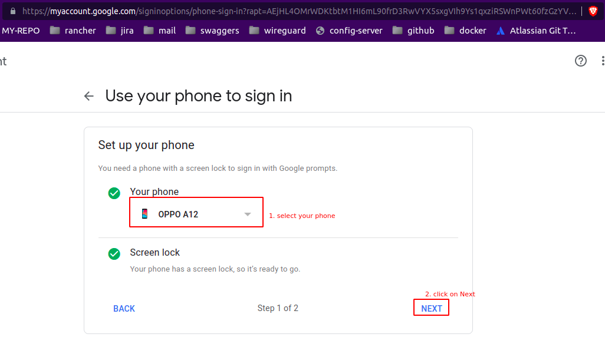
   Enter your `Gmail-ID` and click on `Next`.
   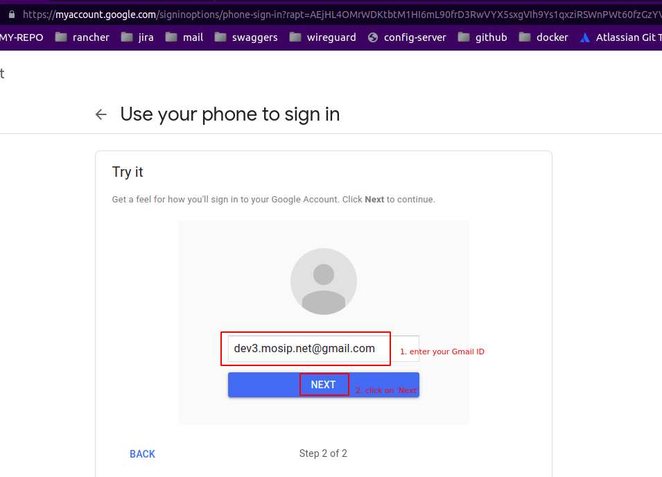
   Click on `YES` from your mobile.
   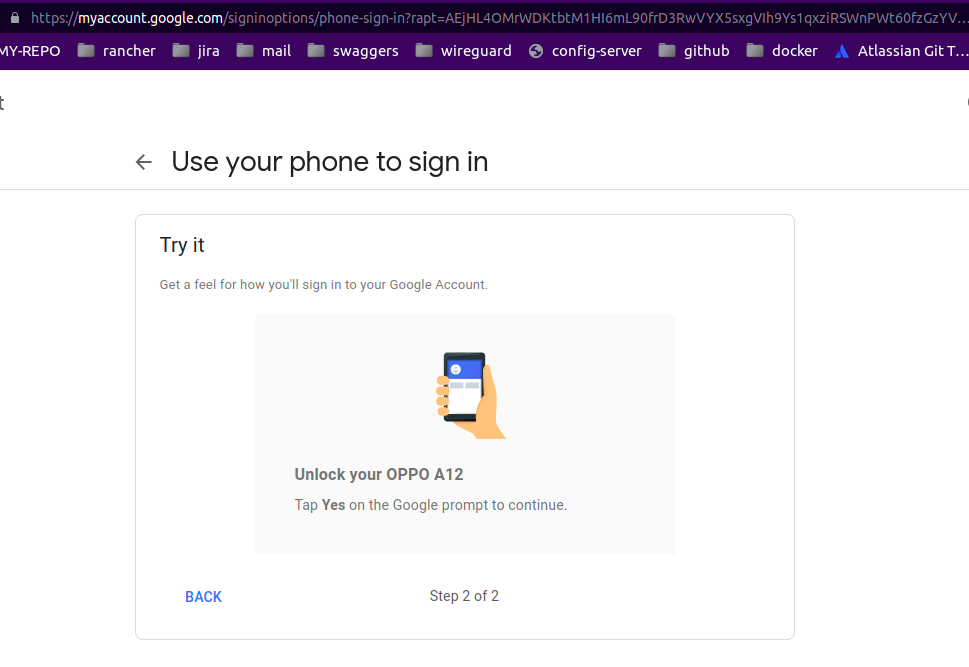
   Click on `Turn On` to start using your phone to sign in.
   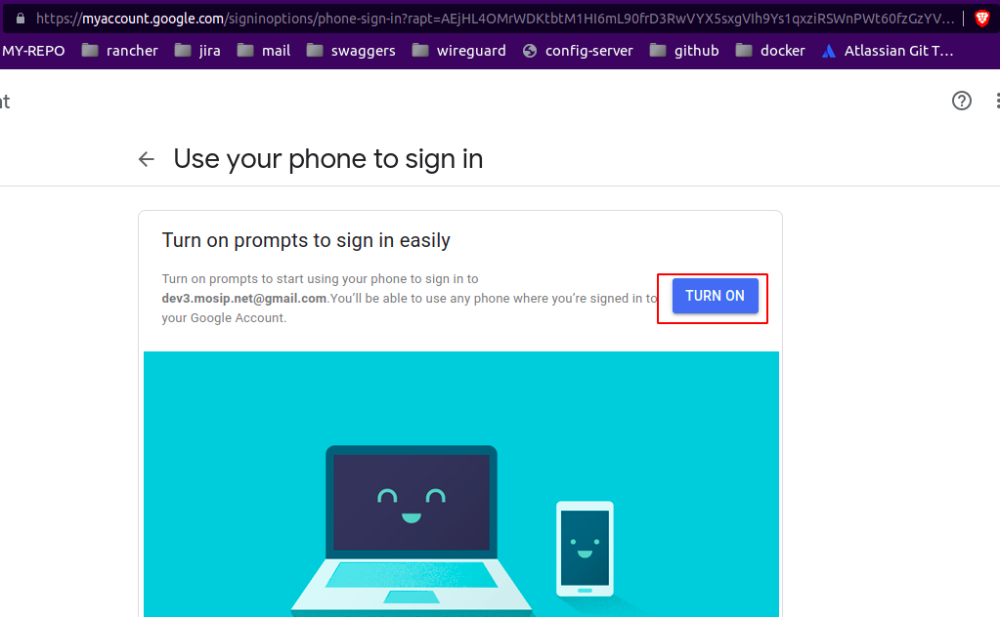
   `Use your phone to sign in` is enabled for your Gmail-ID.
   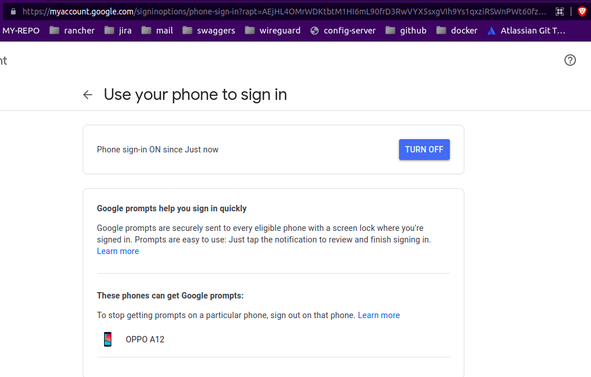
5. Goto `security` section and click on `2-Step Verification`.
   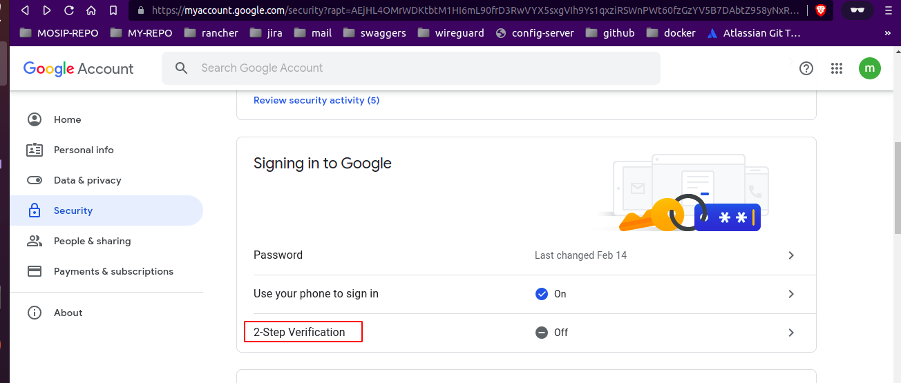
   Click on 'Get Started' to enable `2-Step Verification`.
   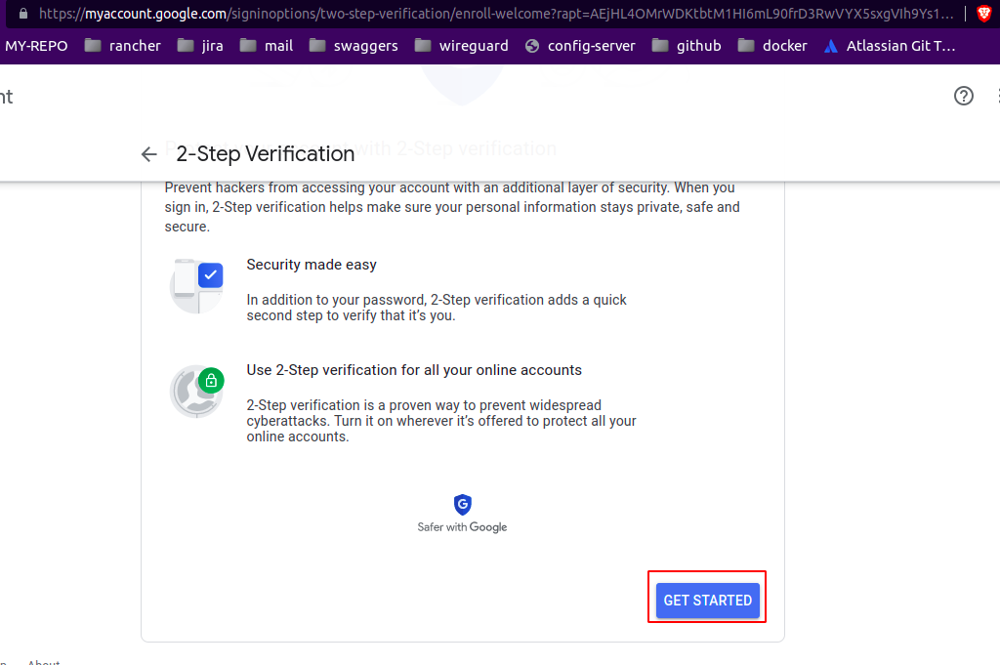
   You have to use your mobile to allow to signIn and provide OTP for the same.
   Click on `continue`.
   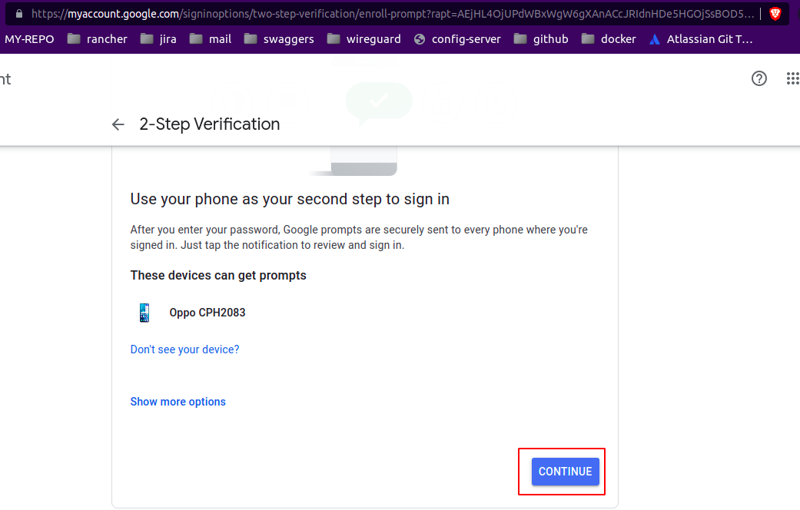
   Provide your mobile number and click on `Send`.
   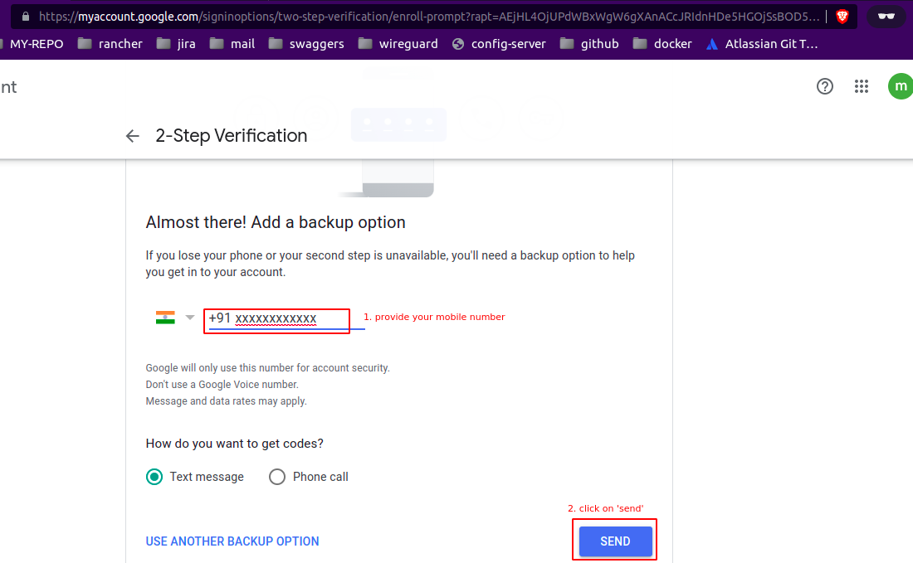
   Enter confirmation `OTP` and click on `Next`.
   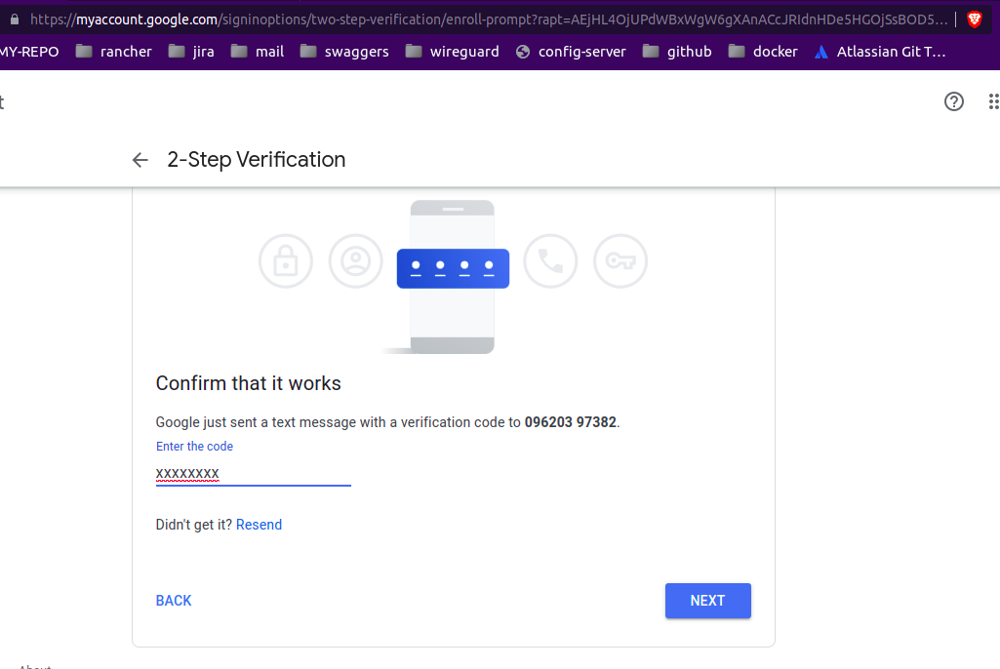
   Click on `Turn On` to enable `Two-step verification`.
   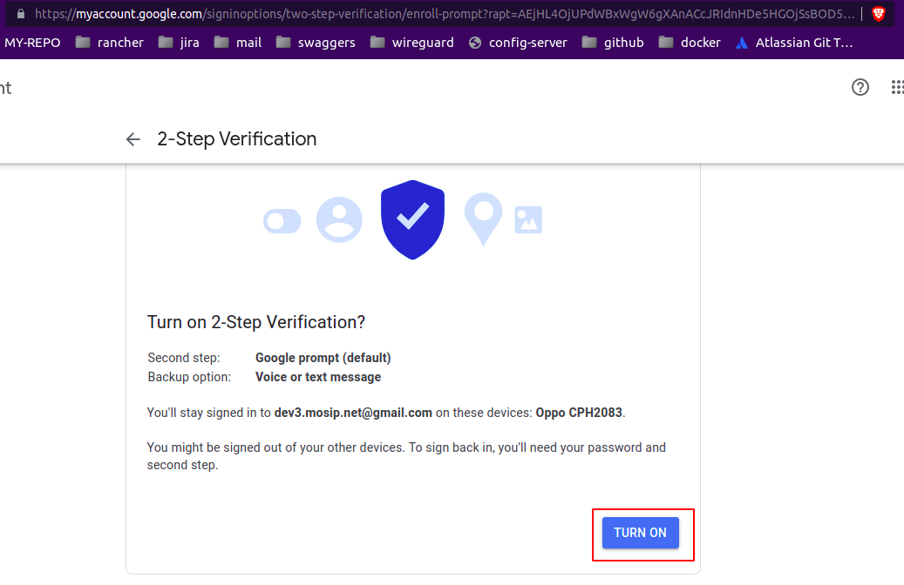
   Two-step verification has been enabled.
   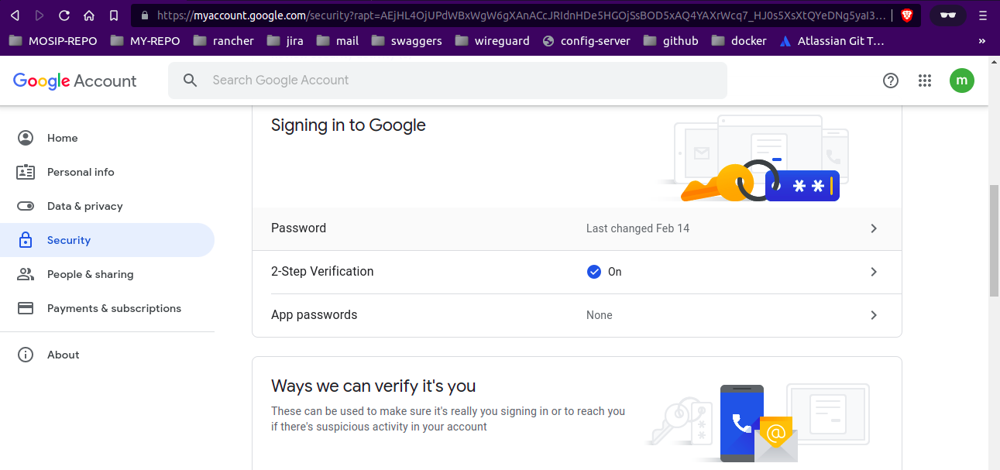
6. Click on `App passwords` to generate password for third party apps.
   
   Enter the password of your Gmail account > continue.
   Click on `Select app` > select `Other (Custom name)`
   
   Enter `application name` and click on `Generate`.
   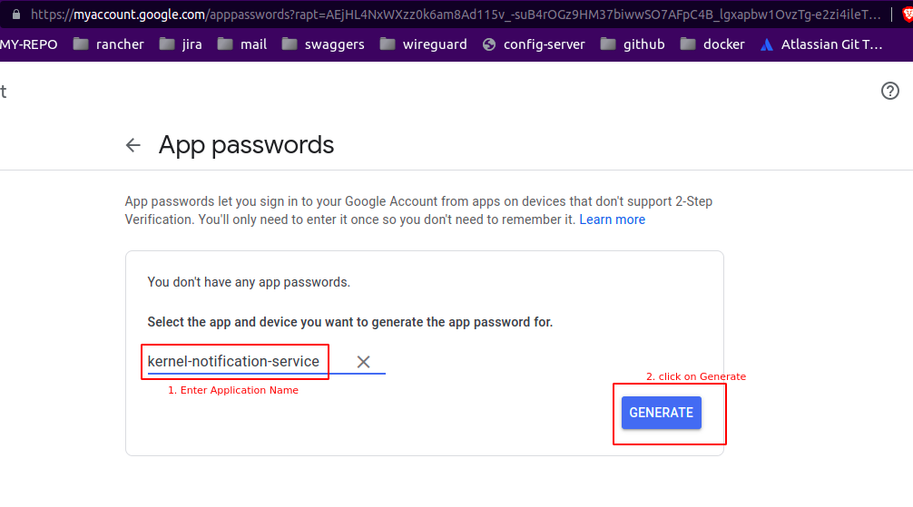
   Copy the Generated password.
   
7. Pass the Generated password to while running `msg-gateway/install.sh` bash script.
   ```
   techno-384@techno384-Latitude-3410:~/Desktop/MOSIP/mosip-infra/deployment/v3/external/msg-gateway$ ./install.sh 
   Create msg-gateways namespace
   ....
   ....
   Please enter the SMTP host smtp.gmail.com
   Please enter the SMTP user dev3.mosip.net
   Please enter the SMTP secret key fuxxxxxxxxxxx
   ...
   ...
   ```
8. Make sure config-server's configmap `email-gateway` and secrets `email-gateway` are update to date,
   if not update it and restart config-server.
9. Restart kernel notification service.
10. After restart, we will get notification from Google on our mobile regarding whether to allow to signIn or not.
    we allow to click on `Yes it was me`.

# References

1. [support.teamgate.com](https://support.teamgate.com/hc/en-us/articles/115002064229-How-to-create-a-password-to-connect-email-while-using-2-step-verification-in-Gmail-)