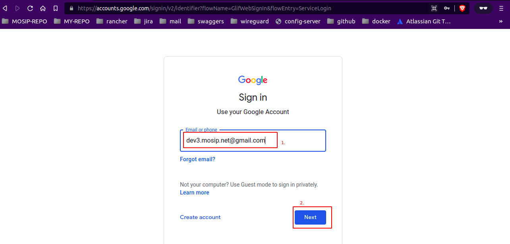
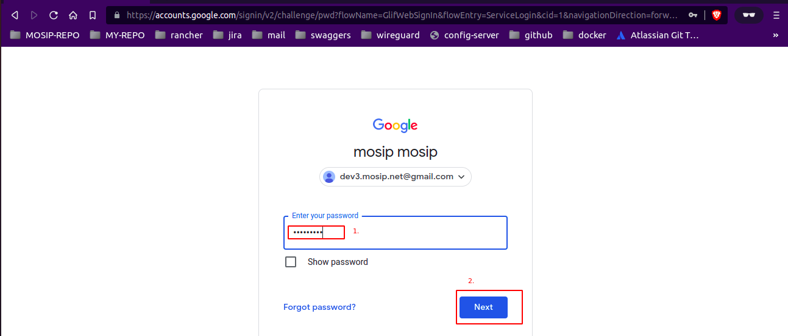
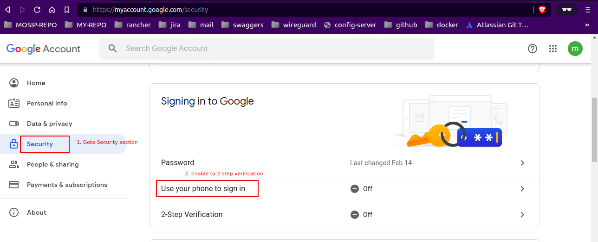
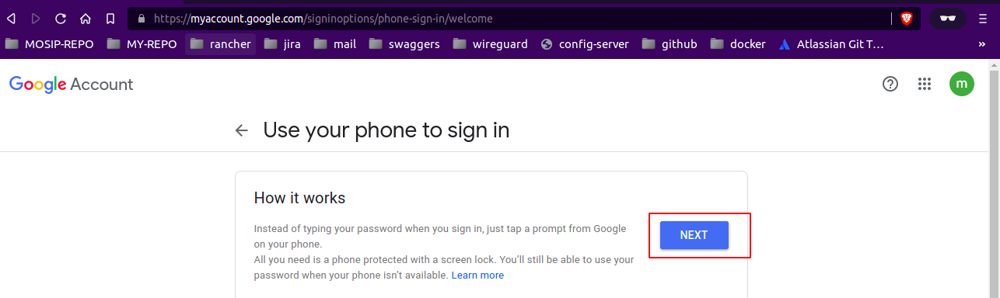

# Create Gmail APP Password To Send Mails Via SMTP


1. Login to your concerned gmail account [link](https://accounts.google.com/signin).
2. Goto `security` section, enable [Use your phone to sign in](https://support.google.com/accounts/answer/6361026?hl=en&co=GENIE.Platform%3DAndroid) and 
   [2-Step Verification](https://support.google.com/accounts/answer/185839?hl=en&co=GENIE.Platform%3DAndroid).
3. Click on `App passwords` to generate password for third party apps.<br>
   <br>
   Click on `Select app` > select `Other (Custom name)`<br>
   <br>
   Enter `application name` and click on `Generate`.<br>
   <br>
   Copy the Generated password.<br>
   <br>
4. Pass the Generated password to while running `msg-gateway/install.sh` bash script.
   ```
   techno-384@techno384-Latitude-3410:~/Desktop/MOSIP/mosip-infra/deployment/v3/external/msg-gateway$ ./install.sh 
   Create msg-gateways namespace
   ....
   ....
   Please enter the SMTP host smtp.gmail.com
   Please enter the SMTP user xxxxx@gmail.com
   Please enter the SMTP secret key xxxxxxxxxxxxx
   ...
   ...
   ```

# Troubleshoot

1. Make sure below listed properties from `kernel-default.properties` or `kernel-*.properties` file in config set to false.
   ```
   management.health.mail.enabled=false
   mosip.kernel.sms.proxy-sms=false
   mosip.kernel.mail.proxy-mail=false
   ```

# References

1. [support.teamgate.com](https://support.teamgate.com/hc/en-us/articles/115002064229-How-to-create-a-password-to-connect-email-while-using-2-step-verification-in-Gmail-)