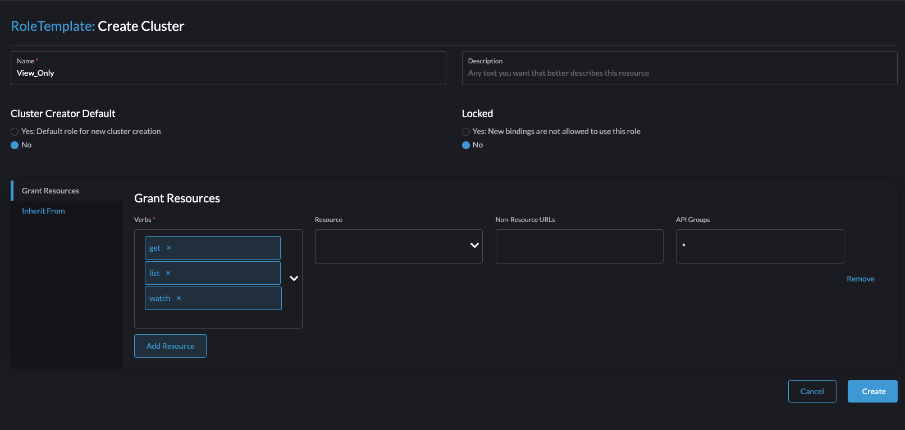

# # How to add view only user on cluster api using rancher

Rancher by default have `Owner`, `Member` and `Custem` cluster permission, but none of this grants read only to a user. 

As a prerequisite, you need to have admin access on the rancher it self (thi is separate from cluster 
admin). After logging as admin go to `Users & Authentication` under `Configuration` -> `Create Cluster Role`
- Name: give a name for a role i.e view-only 
- Under Grat Resources, select `get`, `list` and `watch` as verbs and `*` for `Resources` and `API Groups`

After saving this role setting you should be able to get view_only role as part of defined roles when adding user to cluster.

