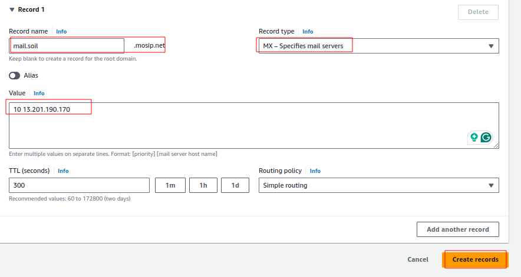
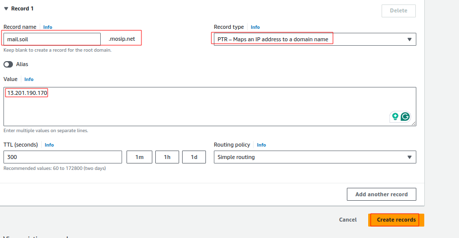
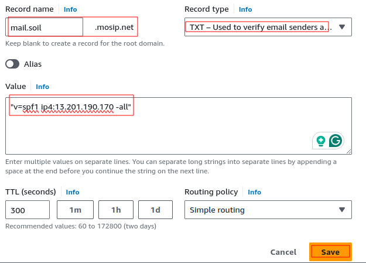
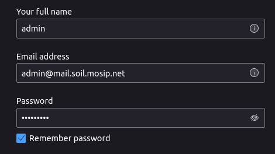
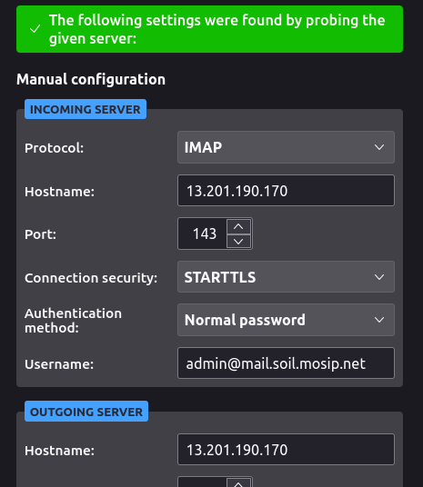
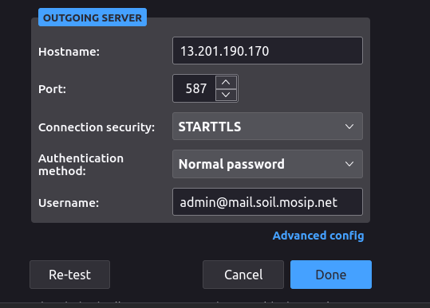
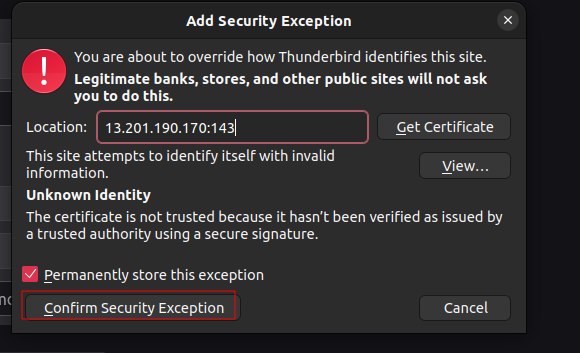
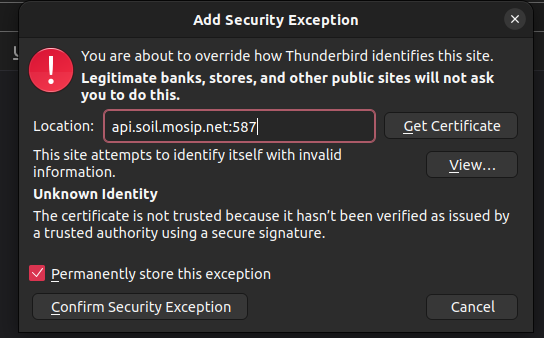

# Setup email server via apache james on ubuntu

* Ensure to install [docker](https://docs.docker.com/engine/install/ubuntu/) on ubuntu machine.
* Create `MX`,`PTR`, & `TXT` DNS records which points to public IP of ubuntu machine.
  
  
  <br>
  verify via below command:
  ```
  $ host -t MX mail.soil.mosip.net
    mail.soil.mosip.net mail is handled by 10 13.201.190.170.
  ```
* Run the below docker command to set up mail server.
  ```
  docker run -d --name james -p 143:143 -p 587:587 apache/james:demo-3.8.0
  ```
* Ensure to open firewall ports via below command:
  ```
  sudo ufw allow 143/tcp
  sudo ufw allow 587/tcp
  ```
* Login to james docker to create domain & user to james server.
  ```
  ubuntu@ip-172-31-15-176:~$ docker ps
  CONTAINER ID   IMAGE                     COMMAND          CREATED         STATUS         PORTS                                                                                                                                NAMES
  5bf8e2fd568e   apache/james:demo-3.8.0   "./startup.sh"   7 minutes ago   Up 7 minutes   25/tcp, 80/tcp, 0.0.0.0:143->143/tcp, :::143->143/tcp, 465/tcp, 993/tcp, 4000/tcp, 8000/tcp, 0.0.0.0:587->587/tcp, :::587->587/tcp   james

  ubuntu@ip-172-31-15-176:~$ docker exec -it james bash
  root@5bf8e2fd568e:~#
  ```
  ```
  root@5bf8e2fd568e:~# james-cli -h 127.0.0.1 -p 9999 AddDomain mail.soil.mosip.net
  AddDomain command executed sucessfully in 504 ms.

  root@5bf8e2fd568e:~# james-cli -h 127.0.0.1 -p 9999 AddUser admin@mail.soil.mosip.net <admin-user-email-password>
  AddUser command executed sucessfully in 474 ms.
  ```
* Open `thunderbird` application to login in to your mail server account.
* Goto `Settings` ---> `Account Settings` ---> `Account Actions` ---> `Add Mail Account`.
* Provide server details, login credentials as shown below:<br>
  
  
* Click on test/re-test to verify server accessibility.<br>
  
* Tick `permanently store this exception` and click on `Confirm Security Exception.
  
* Tick `permanently store this exception` and click on `Confirm Security Exception.
  You will receive this while sending a mail from your account.<br>
  
* Try sending/receiving mails from one account to another.


# Troubleshooting

* If you are not able ot send / receive mail, this could be due to the sender/receiver mail server has blocked your mail server.
  For example:
  ```
  Hi. This is the James mail server at 0062d7fb41a3.
  I'm afraid I wasn't able to deliver your message to the following addresses.
  This is a permanent error; I've given up. Sorry it didn't work out.  Below
  I include the list of recipients and the reason why I was unable to deliver
  your message.
  
  Original email subject: as
  
  Failed recipient(s):
  syedsalman041997@gmail.com
  
  Error message:
  550-5.7.26 This mail has been blocked because the sender is unauthenticated.
  550-5.7.26 Gmail requires all senders to authenticate with either SPF or DKIM.
  550-5.7.26
  550-5.7.26  Authentication results:
  550-5.7.26  DKIM = did not pass
  550-5.7.26  SPF [mail.camdgc-dev.mosip.net] with ip: [164.52.204.214] = did not
  550-5.7.26 pass
  550-5.7.26
  550-5.7.26  For instructions on setting up authentication, go to
  550 5.7.26  https://support.google.com/mail/answer/81126#authentication d12-20020a170903230c00b001db420e7552si10082865plh.65 - gsmtp
  ```
  Resolution for **Microsoft Office email accounts**:
  * De-list your mail server IP via [Office 365 Anti-Spam IP De-list Portal](https://sender.office.com/)
  * Provide your mail server Email ID, public IP, and click on Submit.
  * You will receive a confirmation mail click on it.
  * It will take 30 minutes to remove the IP from [Office 365 Anti-Spam IP De-list Portal](https://sender.office.com/).