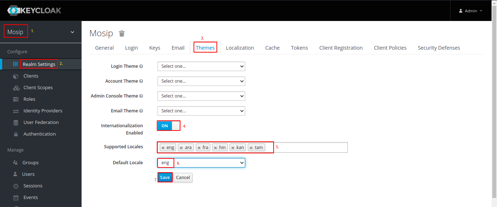
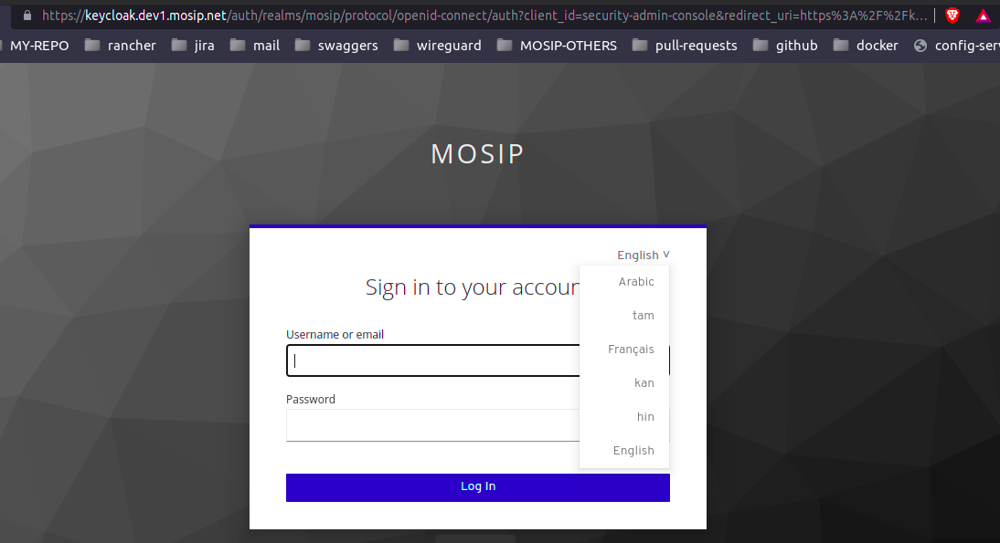
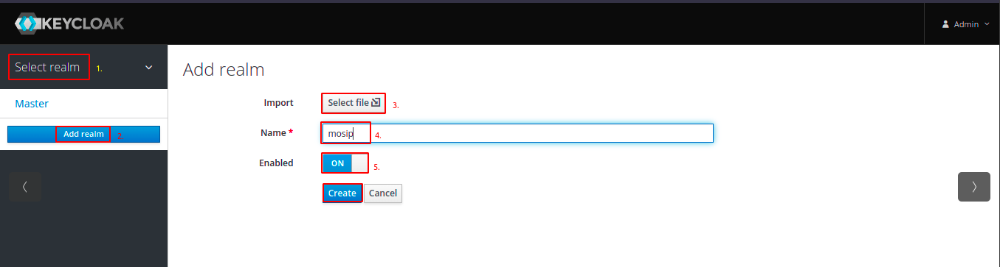
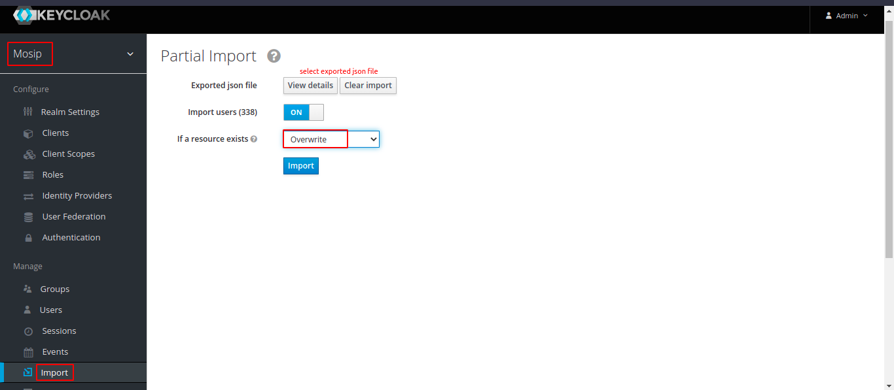

# Keycloak

## Introduction
An organisation may use any OAuth 2.0 compliant Identity Access Management (IAM) system with MOSIP.  Here we provide k8s installation procedure for **Keycloak** which is the default supported IAM with MOSIP.

- It is recommended to have two seperate installations of keycloak;
  1. One for organisation wide access to Rancher in order to access different clusters there which is already installed [here](../../rancher/keycloak/README.md). It is installed in the rancher cluster the same will be only one throughout the organisation.
  1. Second installation of keycloak will be in the MOSIP cluster as external dependency for every MOSIP cluster. This will be used by MOSIP modules for authentication and authorization.

## Prerequisites
The `install.sh` script here assumes that configmap `global` is already there in the default namespace. 

## Install
* Use the `install.sh` provided in this directory. This will install Keycloak as bitnami helm chart. 
* To further configure `values.yaml` and for any other info, refer [here](https://github.com/bitnami/charts/tree/master/bitnami/keycloak). 
```
$ ./install.sh <kubeconfig file for this cluster>
```
* Bitnami keycloak chart here installs postgres too.  If you already have an external postgres DB, point to the same while installing.
* For postgres persistence the chart uses default storage class available with the cluster.
* While deleting helm chart note that PVC, PV do not get removed for Statefulset. This also means that passwords will be same as before. Delete them explicity if you need to. CAUTION: all persistent data will be erased if you delete PV.
* To retain data even after PV deletion use a storage class that supports "Retain".  On AWS, you may install `gp2-retain` storage class given here and specify the same while installing Keycloak helm chart.

## Existing Keycloak
* In case you have not installed Keycloak by above method, and already have an instance running, make sure Kubernetes configmap and secret is created in namespace `keycloak` as expected in [keycloak-init](https://github.com/mosip/mosip-helm/blob/develop/charts/keycloak-init/values.yaml):
  ```
  keycloak:
    host:
      existingConfigMap: keycloak-host
      key: keycloak-host-url
    admin:
      userName:
        existingConfigMap: keycloak-env-vars
        key: KEYCLOAK_ADMIN_USER
      secret:
        existingSecret: keycloak
        key: admin-password
  ```

## Secret change
In case you change admin password directly from console, then update the secret as well:
```
$ ./update_secret.sh <admin new password> <kubeconfig file for this cluster>
```
You may get the current admin password:
```
$ ./get_pwd.sh <kubeconfig file for this cluster>
```

## Keycloak docker version
TODO: The keycloak docker version in `values.yaml` is an older version as the version 12.04 (latest bitnami) was crashing for `userinfo` request for client (like mosip-prereg-client). Watch latest bitnami release and upgrade 13+ version when available.

## Keycloak Init
To populate base data of MOSIP, run Keycloak Init job:
```
$ ./keycloak_init.sh <kubeconfig file for mosip cluster>
```

## Frontend URL
- Navigate to keycloak admin console.
- Navigate to `Mosip` realm.
- Configure *Frontend URL* property in *Realm Settings* page. Value for the frontend url should be: `https://<mosip-iam-external-host>/auth`. Eg: `https://iam.sandbox.mosip.net/auth`.
- Save it.

Automated this as part of keycloak-init

## Enable Multi Languages in keycloak
- Navigate to the keycloak admin console.
- Navigate to `Mosip` realm.
- Navigate to `Realms Settings` ----> `Themes`.
- Enable `Internationalization Enabled`.
- Set languages in `Supported Locales`.
- Click on `Save`.
  
- Confirm via checking languages in `Mosip` admin login page `https://iam.sandbox.xyz.net/auth/admin/mosip/console/`.
  

TODO: Automate this as part of keycloak-init

## EXPORT 

### Export from Jboss keycloak 9.0.0

* Copy `export.sh` to the console machine of the specific environment and run the `export.sh`. <br>
  Make sure the console has Kubernetes cluster access.
  ```sh
  ./export.sh
  ```
  ```
  Provide kubernetes cluster config file path : <k8s-cluster-config-file>
  Provide keycloak namespace ( Default namespace: default ) : <namespace-of-keycloak>
  Provide directory location for export files ( Default Location: current directory ) : <path-to-export-keycloak-files>
  Created Export Directory : <path-to-export-keycloak-files>
  Provide "No of users per file" ( Default: 1000, Recommended value: total number of users ) : <total-no-of-keycloak-users>
  ```
* Press `ctrl+c` once after `Export finished successfully` displayed.
  ```
  18:07:06,903 INFO  [org.keycloak.services] (ServerService Thread Pool -- 62) KC-SERVICES0035: Export finished successfully
  ```
* Copy exports files from console machine to your local.

### Export from Bitnami keycloak ( Helm/chart Version: 7.1.18 )
* Set the `KEYCLOAK_EXTRA_ARGS` as an environmental variable in "keycloak" statefulSets to export realm & its users.
* Set the value for `-Dkeycloak.migration.usersPerFile` ( Recommended value: total number of users ) to the below environmental variable value.
  ```
  name: KEYCLOAK_EXTRA_ARGS
  value: '-Dkeycloak.profile.feature.upload_scripts=enabled -Dkeycloak.migration.action=export -Dkeycloak.migration.provider=dir -Dkeycloak.migration.realmName=mosip -Dkeycloak.migration.usersExportStrategy=DIFFERENT_FILES -Dkeycloak.migration.usersPerFile=<TOTAL-NUMBER-OF-USERS> -Dkeycloak.migration.file=/'
  ```
* Wait till the application is up and running.
* Keycloak will be exported to location `/opt/bitnami/keycloak/standalone/keycloak-export/`.
* Copy the `keycloak-export` directory from the above location to your local via the `kubectl cp` command.

## IMPORT

### Import to Bitnami Keycloak ( Helm chart version: 7.1.18 )
* If already existing keycloak is running, set the environmental variable `KEYCLOAK_EXTRA_ARGS=-Dkeycloak.profile.feature.upload_scripts=enabled` to enable the import feature.
* Run `install.sh` to deploy keycloak with the import feature enabled.
  ```sh
  ./install.sh
  ```

### Import Realm via Keycloak UI
* Login to keycloak Admin console, Navigate `Master` realm and Click on `Add Realm`.
* Click on the `select file` to Import the keycloak realm. Select keycloak exported realm JSON file.
* Set realm name to `mosip` and click on `create`.
  

### Import Users via Keycloak UI
* Login to keycloak Admin console, Navigate to `Mosip` realm.
* Click on `Import` ---> Select `Exported json file` and click on `Import`.
  

### IMPORT INIT

* Update realm, roles, clients, & service account client roles details in `import-init-values.yaml`.
* run `import-init.sh`
  ```sh
  ./import-init.sh
  ```
