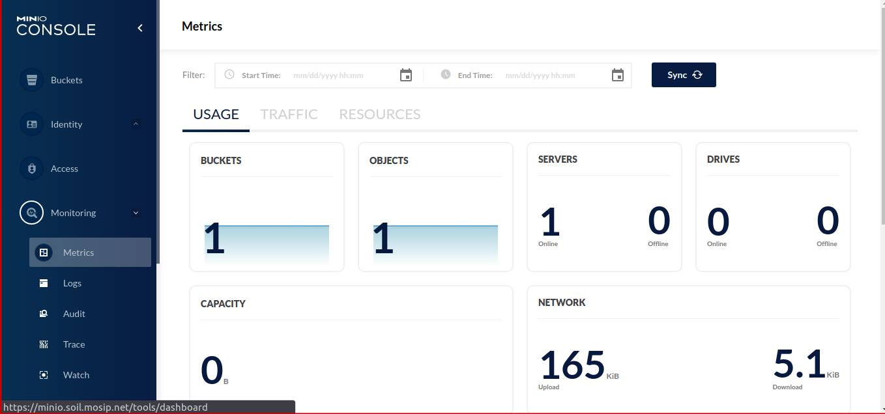

# MinIO

## Introduction
MinIO is a High Performance Object Storage released under GNU Affero General Public License v3.0. It is API compatible with Amazon S3 cloud storage service.  MinIO is required for on-prem setups. If you are installing MOSIP on cloud you need explore cloud native options that support S3 API.  On AWS, it would be S3.  

## Helm chart based install
Recommended for sandbox installations:
* Install helm chart
```
./install.sh
``` 
* Create secrets for config server
```
cd ..
./cred.sh
```
## Operator based installation 
Recommended for multi-tenant production based installation.
See [MinIO Operator Based Installation Guide](operator/README.md).

## Install MinIO client
To install the MinIO client, follow the procedure from [here](https://docs.min.io/docs/minio-client-complete-guide.html).

## MinIO Clone
* Set `alias` for MinIO servers.
  ```
    mc alias set <src-alias-name> <source-server-url>:<port> <minio-root-user> <minio-root-password> --api S3v2  ( old version )
    mc alias set <dest-alias-name> <destination-server-url>:<port> <minio-root-user> <minio-root-password> --api S3v2  ( latest versions )
    mc alias ls
  ```
* Clone MINIO buckets from one MinIO server to another MinIO server.
  ```
    mc mirror <src-alias-name> <dest-alias-name>
  ```

## Backup and restore MinIO

* Set `alias` for MinIO servers using mc command line tool.
*  The below commands is creating an alias named "<src-alias-name>" for a MinIO server located at "<source-server-url>:<port>" with the username "<minio-root-user>" and password "<minio-root-password>", using the S3 API version 2.

### Note:
* Make sure to replace <src-alias-name>, <source-server-url>:<port>, <minio-root-user> and <minio-root-password> with your original values before exicuting the below commands.
* --api S3v2: This specifies the API version being used. In this case, it's specifying version 2 of the S3 API, which is used for interacting with object storage systems like MinIO.
* Set `alias` for MinIO servers.


  ```
    mc alias set <src-alias-name> <source-server-url>:<port> <minio-root-user> <minio-root-password> --api S3v4  ( old version )
    mc alias set <dest-alias-name> <destination-server-url>:<port> <minio-root-user> <minio-root-password> --api S3v4  ( latest versions )
    mc alias ls
  ```

#### Backup
* Create a backup directory.
  ```
    mkdir -p <backup-directory>
  ```
* Backup all MinIO buckets to `<backup-directory>` directory.
  ```
    mc mirror <src-alias-name> <backup-directory>
  ```

#### Note:
* the above mirror command is used to initiate the mirroring process.
* So, essentially, when you execute the above command, it will start mirroring data from the source location specified by <src-alias-name> to the destination location specified by <dest-alias-name>.
* do update your <src-alias-name> and <dest-alias-name> with the alias name you've set and then run the command.

#### Restore

* Set `MINIO_SERVER` and `MINIO_BACKUP_DIR`.
  ```
    MINIO_SERVER=<dest-alias-name>
    MINIO_BACKUP_DIR=<backup-directory>
  ```

* Run below command to restore MinIO buckets from `<backup-directory>`.
  ```
    for bucket in $( ls $MINIO_BACKUP_DIR ); do
      echo $MINIO_SERVER/$bucket;
      mc mb --ignore-existing $MINIO_SERVER/$bucket;
      mc mirror $MINIO_BACKUP_DIR/$bucket $MINIO_SERVER/$bucket;
    done
  ```

#### Connecting Minio to Prometheus
Prometheus needs to scrape data from minio buckets for continuous monitoring. 

Service monitor should be enabled in values.yaml script for prometheus to scrape the data from minio.

Then the minio dashboard should display the metrics that are scraped by prometheus. 

The following environmental variables needs to be mapped for the same.

```MINIO_PROMETHEUS_URL - http://rancher-monitoring-prometheus.cattle-monitoring-system:9090```

```MINIO_PROMETHEUS_JOB_ID - minio```



The above mentioned changes are taken care in values.yaml script.


## Troubleshoot
* If you encounter the following error while attempting to access MinIO.
  ```
  mc: <ERROR> Unable to list folder. The request signature we calculated does not match the signature you provided. Check your key and signing method
  ```
  Then, ensure that you provide the appropriate API version, either `--api S3v2` or `--api S3v4`, when executing the `mc set alias` command.
