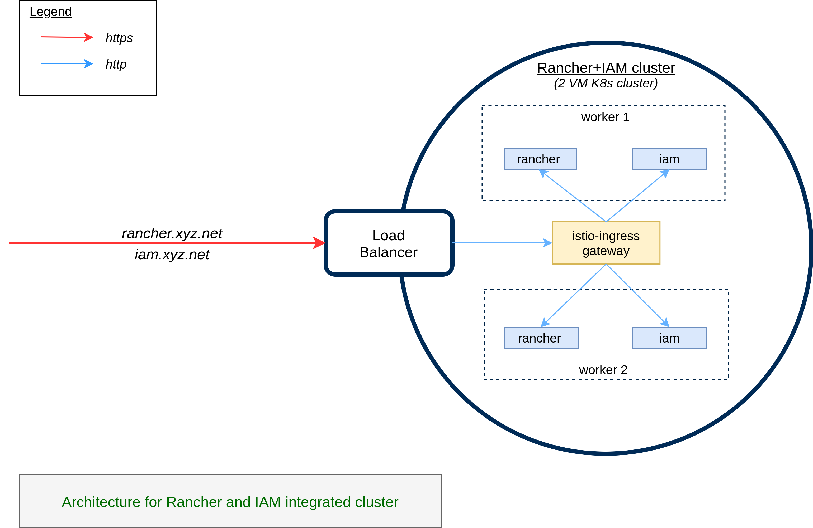

# Rancher Management Server

## Introduction
Rancher is used to manage all your clusters.  Typically, you would need just one installation per project or organisation.
Install Rancher before you install MOSIP cluster.  While Rancher may be installed native, or just using Docker on any VM, for high availability and management we recommend installing it on a Kubernetes cluster. You may also use the same cluster to install IAM [Keycloak](https://www.keycloak.org/).  Here, we provide instructions to install Rancher Management Server along with Keycloak within the same cluster.  



## Cluster install
* [aws](aws/README.md)
* [on-prem](on-prem/README.md)

## Keycloak
Refer [here](keycloak/README.md) for installation of Keycloak.

## Rancher
* Install Rancher using Helm.
    ```
     helm install rancher rancher-latest/rancher \
      --namespace cattle-system \
      --set hostname=rancher.mosip.net \
      --set replicas=2 \
      --set bootstrapPassword=admin \
      --set tls=external
    ```

## Login
* Open Rancher page `https://rancher.mosip.net`.
* Get Bootstrap password using
    ```
    kubectl get secret --namespace cattle-system bootstrap-secret -o go-template='{{ .data.bootstrapPassword|base64decode}}{{ "\n" }}'
    ```
* Assign a password.  IMPORTANT: makes sure this password is securely saved and retrievable by Admin.

## Keycloak-Rancher integration
* Login as "admin" user in Keycloak and make sure an email id, and first name field is populated for "admin" user. This is important for Rancher authentication as given below.
* Enable authentication with Keycloak using the steps given [here](https://rancher.com/docs/rancher/v2.5/en/admin-settings/authentication/keycloak/).
* In Keycloak add another Mapper for the rancher client (in Master realm) with following fields:
  * Protocol: saml
  * Name: username
  * Mapper Type: User Property
  * Property: username
  * Friendly Name: username
  * SAML Attribute Name: username
  * SAML Attribute NameFormat: Basic

* Specify the following mappings in Rancher's Authentication Keycloak form:
  * Display Name Field: givenName
  * User Name Field: email
  * UID Field: username
  * Entity ID Field: https://your-rancher-domain/v1-saml/keycloak/saml/metadata
  * Rancher API Host: https://your-rancher-domain
  * Groups Field: member

* For users in keycloak assign roles rancher - cluster and project roles.  Under `default` project add all the namespaces. Then, for a non-admin user you may provide Read-Only role (under projects).
* Add a member to cluster/project in Rancher:
  * Give member name exactly as `username` in Keycloak
  * Assign appropriate role like Cluster Owner, Cluster Viewer etc.
