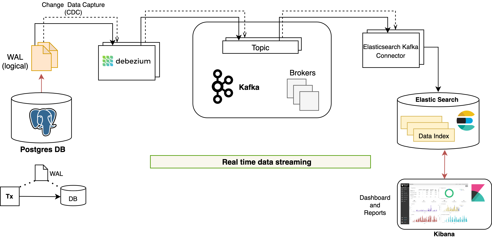

## Reporting framework

### Introduction
Reference reporting framework for real-time streaming data and visualization.  

#### High level architecture




## Installation

#### 1. Prerequisites

- It is assumed that Elasticsearch and Kibana are already installed in the cluster.
- Assumed Postgres is already installed with `extended.conf` as extended config.

#### 2. Install

The `install.sh` script installs all the following components:
  - `reporting` Helm chart:
    - Debezium Kafka Connect
    - Elasticsearch Kafka Connect 
    - Kafka+Zookeeper _(optional)_
    - Elasticsearch & Kibana _(optional)_
  - `reporting-init` Helm chart:
    - Debezium-Postgres connectors
    - Elasticsearch-Kafka connectors

Install:
- Inspect `values.yaml` and `values-init.yaml` and configure appropriately.  Leave as is for default for installation.
- Run
```sh
./install.sh <kube-config-file>
```

- NOTE: for the db_user use superuser/`postgres` for now, because any other user would require the db_ownership permission, create permission & replication permission. (TODO: solve the problems when using a different user.)
- NOTE: before installing, `reporting-init` debezium configuration, make sure to include all tables under that db beforehand. If one wants to add another table from the same db, it might be harder later on. (TODO: develop some script that adds additional tables under the same db)

#### 3. Installing addtional connectors
This section is when one wants to install additional connectors that are not present in the reference connectors (or) if one wants to install custom connectors.

- Note: Both the following methods will not add additional tables of existing db to debezium. (Example: it wont add `prereg.otp_transaction`, if other prereg tables have been added before) For this, one will have to edit that db's existing debezium connector manually.

###### Method 1:

- Put the new elasticsearch connectors in one folder.
	- Create a configmap with for this folder, using:
	```
	$ kubectl create configmap <conf-map-name> -n reporting --from-file=<folder-path>
	```
	- Edit in values-init.yaml, to use the above configmap:
	```
	es_kafka_connectors:
		existingConfigMap: <conf-map-name>
	```
- Edit in values-init.yaml, the debezium_connectors for new dbs and tables. Or disable if not required.
	- Can also use a custom debezium connector using the following. (Not recommended)
	- Create a configmap with custom debezium connector:
	```
	$ kubectl create configmap <conf-map-name> -n reporting --from-file=<path-for-debez-connector>
	```
	- Edit in values-init.yaml, to use the above configmap:
	```
	debezium_connectors:
		existingConfigMap: <conf-map-name>
	```
- Install reporting-init again. (First delete any previously completed instance. This wont affect the cluster/installation)
```
$ helm -n reporting delete reporting-init
$ helm -n reporting install reporting-init mosip/reporting-init -f values-init.yaml
```

###### Method 2 (manually):

- Edit the `./sample_connector.api` file, accordingly. And run the following;
```
$ ./run_connect_api.sh sample_connector.api <kube-config-file>
```

## Installing Kibana Dashboards using the script

- The dashboards in the `ref_kibana_saved_objects` folder can be installed manually from the ui.
- Or use the script, for each dashboard.
	```
	$ ./install_kibana_object.sh <file_name> <replace_name>
	```
	- The 2nd argument is optional. It replaces this string `___DB_PREFIX_INDEX___` with this 2nd argument, inside the ndjson file.
	- Give a unique name in this argument, for this set of dashboards.

## Cleanup/uninstall

- Delete the reporting components
```
$ helm delete reporting-init -n reporting
$ helm delete reporting -n reporting
$ kubectl delete ns reporting
```
- Postgres Cleanup
	- List replication replication slots.
	```
	postgres=# select * from pg_replication_slots;
	```
	- Delete each of the above slots.
	```
	postgres=# select pg_drop_replication_slot('<slot_name>');
	```
	- Go to each database, and drop publication.
	```
	postgres=# \c <db>
	postgres=# select * from pg_publication;
	postgres=# drop publication <pub_name>;
	```
- Kafka Cleanup
	- It is recommended to cleanup all topics related to reporting in kafka, as the data will anyway be there in db/elasticsearch
	- Delete all the relavent topics and the debezium and es kafka connectors' `status`, `offset` and `config` topics.
- Elasticsearch and Kibana Cleanup
	- One can delete the es indices, and delete the dashboards from kibana from the ui, if required.
