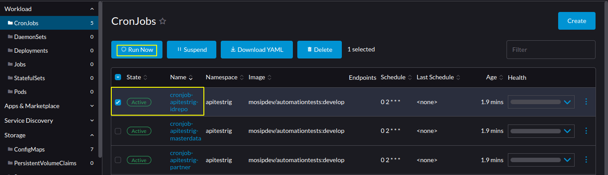

# APITESTRIG

## Introduction
ApiTestRig will test the working of APIs of the MOSIP modules.

## Install
* Review `values.yaml` and, Make sure to enable required modules for apitestrig operation.
* Install
```sh
./install.sh
```
* During the execution of the `install.sh` script, a prompt appears requesting information regarding the presence of a public domain and a valid SSL certificate on the server.
* If the server lacks a public domain and a valid SSL certificate, it is advisable to select the `n` option. Opting it will enable the `init-container` with an `emptyDir` volume and include it in the deployment process.
* The init-container will proceed to download the server's self-signed SSL certificate and mount it to the specified location within the container's Java keystore (i.e., `cacerts`) file.
* This particular functionality caters to scenarios where the script needs to be employed on a server utilizing self-signed SSL certificates.

## Run apitestrig manually

#### Rancher UI
* Run apitestrig manually via Rancher UI.
  
* There are two modes of apitestrig `smoke` & `smokeAndRegression`.
* By default, apitestrig will execute with `smokeAndRegression`. <br>
  If you want to run apitestrig with only `smoke`. <br>
  You have to update the `apitestrig` configmap and rerun the specific apitestrig job.

#### CLI
* Download Kubernetes cluster `kubeconfig` file from `rancher dashboard` to your local.
  
* Install `kubectl` package to your local machine.
* Run apitestrig manually via CLI by creating a new job from an existing k8s cronjob.
  ```
  kubectl --kubeconfig=<k8s-config-file> -n apitestrig create job --from=cronjob/<cronjob-name> <job-name>
  ```
  example: 
  ```
  kubectl --kubeconfig=/home/xxx/Downloads/qa4.config -n apitestrig create job --from=cronjob/cronjob-apitestrig-masterdata cronjob-apitestrig-masterdata
  ```

  

