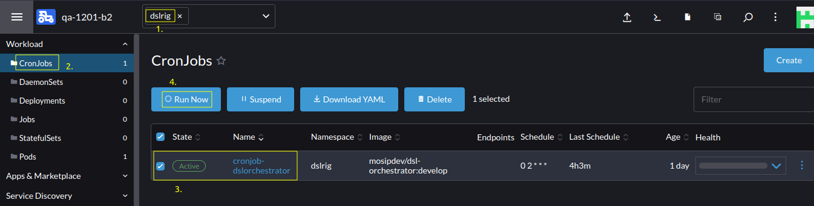

# DSLRIG

## Introduction
DSLRIG will test end-to-end functional flows involving multiple MOSIP modules.

## Prerequisites
* Packet utility running in rancher cluster exposed to be accessed by the cluster.
* Auth demo and DSLRIG to be running in the same cluster.
* NFS server already present and related details.

## Install
* Install
```sh
./install.sh
```

## Uninstall
* To uninstall DSLRIG, run `delete.sh` script.
```sh
./delete.sh 
```

## Run dslrig manually

#### Rancher UI
* Run dslrig manually via Rancher UI.
  
* There are two modes of dslrig `sanity` & `full`.
    * By default, dslrig will execute in `full` mode.
    * If you want to run dslrig with `sanity` mode, 
      Update the `TESTLEVEL` key in the `dslorchestrator` configmap and rerun the dslrig job.

#### CLI
* Download Kubernetes cluster `kubeconfig` file from `rancher dashboard` to your local.
  
* Install `kubectl` package to your local machine.
* Run dslrig manually via CLI by creating a new job from an existing k8s cronjob.
  ```
  kubectl --kubeconfig=<k8s-config-file> -n dslrig create job --from=cronjob/<cronjob-name> <job-name>
  ```
  example: 
  ```
  kubectl --kubeconfig=/home/xxx/Downloads/qa4.config -n dslrig create job --from=cronjob/cronjob-dslorchestrator cronjob-dslorchestrator
  ```

  

