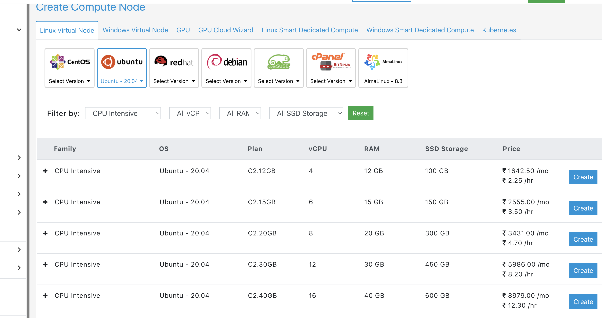

# Installation on E2E Networks

## Create VM 
- Ubuntu 20.04
- Hourly billed
- CPU 12, RAM 30
- Should be same VPC
- Rename the nodes to a consistent name
- Number of replicas
- Public IP is not required as we would use Wireguard (except for Wireguard and Nginx)
- Root user is 'root' (not 'ubuntu')

