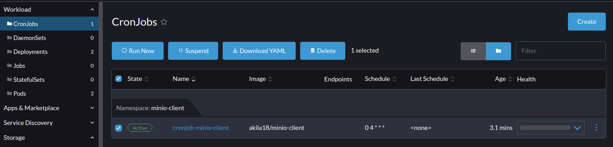

# Minio client Utility

## Context
* This utility helps to clear apitestrig reports from the minio dashboard. 
* The utility is executed as a cronjob which will be executed daily to clear the reports that are older than 3 days.

## Prerequisites
[API Test Rig](https://github.com/mosip/mosip-infra/blob/develop/deployment/v3/mosip/apitestrig/README.md) module must be deployed before installing the minio client utility.

## Install
```sh
./install.sh
```
#### Run minio-client-utility manually via Rancher UI
* Select the minio-client cronjob and click the 'Run Now' option


#### Run minio-client-utility manually via CLI
* Download Kubernetes cluster `kubeconfig` file from `rancher dashboard` to your local.
* Install `kubectl` package to your local machine.
* Run minio-client manually via CLI by creating a new job from an existing k8s cronjob.
  ```
  kubectl --kubeconfig=<k8s-config-file> -n minio-client create job --from=cronjob/<cronjob-name> <job-name>
  ```
  Example:
  ```
  kubectl --kubeconfig=/home/xxx/Downloads/dev.config -n minio-client create job --from=cronjob/cronjob-minio-client cronjob-minio-client
  ```
