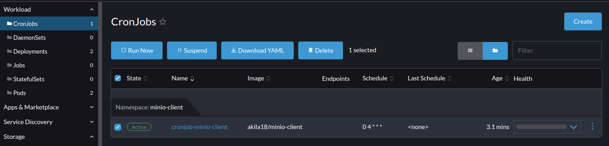

# S3 Client Utility

## Context
* This utility helps to clear objects from S3 buckets.
* The utility is expected to clear objects that are older than specified no of retention days.

## Prerequisites
* S3 accessible using the Server URL.
* ACCESS and SECRET Keys having delete role for the targeted bucket in S3.
* Docker installed in respective server from where the tool will be executed.

## Install
```sh
./install.sh
```
#### Run s3-utility manually via Rancher UI
* Select the s3-utility cronjob and click the 'Run Now' option


#### Run s3-utility manually via CLI
* Download Kubernetes cluster `kubeconfig` file from `rancher dashboard` to your local.
* Install `kubectl` package to your local machine.
* Run s3-utility manually via CLI by creating a new job from an existing k8s cronjob.
  ```
  kubectl --kubeconfig=<k8s-config-file> -n s3-utility create job --from=cronjob/<cronjob-name> <job-name>
  ```
  Example:
  ```
  kubectl --kubeconfig=/home/xxx/Downloads/dev.config -n s3-utility create job --from=cronjob/cronjob-s3-utility cronjob-s3-utility
  ```
